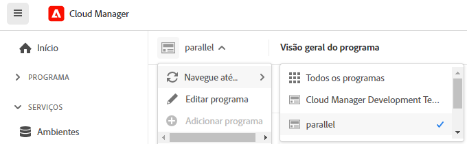
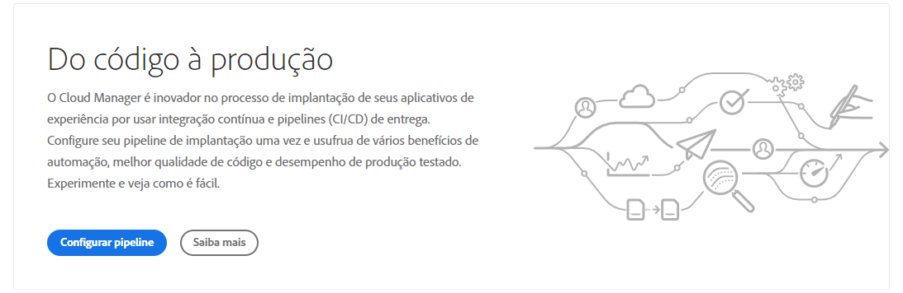

# Navegar na interface do usuário do Cloud Manager {#navigation}

Saiba como a interface do Cloud Manager é organizada e como navegar e gerenciar seus programas e ambientes.

A interface do Cloud Manager é composta principalmente por duas interfaces gráficas:

* [O console Meus programas](#my-programs-console), onde é possível exibir e gerenciar todos os programas.
* [A janela Visão geral do programa](#program-overview), onde é possível ver os detalhes e gerenciar um programa individual.

## Console Meus programas {#my-programs-console}

Ao fazer logon no Cloud Manager em [experience.adobe.com](https://experience.adobe.com/experiencemanager) e selecionar a organização apropriada, você acessa o console **Meus Programas**.

O console **Meus Programas** fornece uma visão geral de todos os programas aos quais você tem acesso na organização selecionada. Ele é composto por várias partes.

|   | Área | Descrição |
| --- | --- | --- |
| 1 | [Barras de ferramentas](#toolbars-my-programs-toolbars) | Use para seleção de organização, alertas e configurações de conta. |
| 2 | Guia do painel lateral esquerdo | Várias guias que permitem alternar a exibição atual de seus programas, incluindo: <ul><li>O **Experience Manager** abre a home page de várias soluções da AEM</li><li>**Todos os programas** que exibem todos os programas disponíveis.</li><li>**Licença** abre o Painel de Licenças. O Painel de Licenças se aplica somente a *programas do AEM as a Cloud Service* (AEMaaCS), não a programas do Adobe Managed Services, como o AEM 6.5 e o AEM 6.5 LTS. Para determinar o tipo de serviço que seu programa tem (AEMaaCS ou AMS), consulte a [seção Cartões de programa](#program-cards) deste artigo. As guias padrão são fechadas e podem ser reveladas usando o , localizado no lado esquerdo do [cabeçalho do Cloud Manager](#cloud-manager-header).</li></ol> |
| 3 | [Meus Programas](#my-programs-section) | Lista todos os programas disponíveis que você pode selecionar. Consulte [Programas e Tipos de Programas](/help/getting-started/program-setup.md) para obter detalhes sobre programas. |
| 4 | [Frases de chamariz e estatísticas](#cta-statistics) | Fornece uma visão geral de sua atividade recente. |
| 5 | [Links rápidos](#quick-links) | Acesso rápido a recursos relacionados. |

### Barras de ferramentas {#my-programs-toolbars}

Há duas barras de ferramentas uma sobre a outra.

#### Cabeçalho do Cloud Manager {#cloud-manager-header}

O primeiro é o cabeçalho do Cloud Manager. O cabeçalho permanece à medida que você navega pelo Cloud Manager. Ele é uma âncora que dá acesso às configurações e informações que se aplicam aos programas do Cloud Manager.

| Área | Descrição |
| --- | --- |
|  | Um menu suspenso que fornece acesso a guias para partes específicas de um programa individual. Para determinar o tipo de serviço que seu programa tem (AMS ou AEMaaCS), consulte a [seção Cartões de Programa](#program-cards) deste documento. |
|  Cloud Manager | Clique para abrir o console **Meus Programas** do Cloud Manager, não importa onde você esteja no Cloud Manager. |
| *`Name of selected organization`* | O seletor de organização exibe a organização na qual você está conectado no momento (neste exemplo, *Foundation Internal*). Clique em para alternar para outra organização se a Adobe ID estiver associada a várias organizações. |
|  Feedback | Clique em para fornecer feedback à Adobe sobre o Cloud Manager. |
|  | O Assistente de IA oferece uma interface conversacional projetada para simplificar a localização de respostas para suas consultas relacionadas ao AEM. Consulte o [Assistente de IA](https://experienceleague.adobe.com/pt-br/docs/experience-manager-65/content/ai-in-aem/ai-assistant/ai-assistant-in-aem#) |
|  | Clique em para fornecer acesso rápido aos recursos de aprendizagem e suporte. |
|  | Clique para exibir o número de [notificações](/help/using/notifications.md) incompletas atribuídas atualmente |
|  | Clique para mover-se rapidamente entre a página inicial da AEM e as soluções da AEM |
| *`Dynamic Account icon`* | Clique na sua imagem de usuário para acessar as **Configurações da Conta** e as **Configurações do Programa**, ou para sair. Se você optou por não adicionar uma imagem de usuário, um ícone será atribuído aleatoriamente (como visto na imagem da barra de ferramentas acima). |

<!--
1. The  icon on the left side of the header is  
   * The License Dashboard only applies to AEM as a Cloud Service programs, not AMS programs.
   * To determine the type of service your program has (AMS or AEMaaCS), see the [Program Cards section](#program-cards) of this document.
1. The **Adobe Cloud Manager** button takes you back to the **My Programs** console of Cloud Manager no matter where you are in Cloud Manager.
1. Click **Feedback** to provide feedback to Adobe about Cloud Manager.
1. The organization selector displays the organization that you are currently signed into (in this example, Foundation Internal). Click to switch to another organization if your Adobe ID is associated with multiple.
1. Clicking the solutions switcher lets you quickly jump to other Experience Cloud solutions.
1. The Help icon provides quick access to learning and support resources.
1. The notifications icon is badged with the number of currently assigned incomplete [notifications](/help/using/notifications.md)
1. Select the icon representing your user to access your user settings. If you do not select a user picture, an icon is randomly assigned. -->

#### Barra de ferramentas do programa {#program-toolbar}

A barra de ferramentas do programa fornece links para alternar entre programas e ações do Cloud Manager adequados ao contexto.

|   | Área | Descrição |
| --- | --- | --- |
| 1 | Meus programas | Clique para abrir uma lista suspensa onde você pode optar por adicionar um programa, selecionar outros programas existentes ou retornar à página inicial do Experience Manager. |
| 2 |  Introdução | Clique em para acessar a [jornada da documentação de integração](https://experienceleague.adobe.com/pt-br/docs/experience-manager-cloud-service/content/onboarding/journey/overview) e começar a usar o Cloud Manager. A jornada de integração foi projetada para o Cloud Manager no Adobe Experience Manager as a Cloud Service (AEMaaCS) e não para o Cloud Manager no Adobe Managed Services (AMS). No entanto, muitos conceitos são os mesmos. |
| 3 | *`Dynamic action button`* | O botão de ação oferece ações adequadas ao contexto em que você pode clicar, como **Adicionar programa** (veja o exemplo acima) ou adicionar um domínio. |

### Frases de chamariz e estatísticas {#cta-statistics}

A seção de chamadas para ação e estatísticas fornece dados agregados para a sua organização. Por exemplo, se você tiver configurado os seus programas com êxito, será possível ver as estatísticas das suas atividades nos últimos 90 dias, incluindo:

* Número de [implantações](/help/using/code-deployment.md)
* Número de [problemas de qualidade de código](/help/using/code-quality-testing.md) identificados
* Número de builds

Ou se você estiver apenas começando a configurar a organização, encontrará dicas sobre as próximas etapas ou recursos de documentação.

### Meus programas {#my-programs-section}

O conteúdo principal do console “Meus programas” é a seção **Meus programas**, que lista os seus programas como cartões individuais. Clique em um cartão para acessar a página **Visão geral do programa** e obter detalhes sobre o programa.

Dependendo dos seus privilégios, talvez não seja possível selecionar determinados programas.

Você pode usar as seguintes opções de classificação para localizar o programa que deseja rapidamente:

* Classificar por:
   * Data de criação
   * Nome do programa
   * Status
*  /  Classificar programas para baixo ou para cima, respectivamente.
*  /  Exiba programas no formato de grade ou lista, respectivamente.

#### Cartões de programa {#program-cards}

Cada cartão ou linha em uma tabela representa um programa e fornece uma visão geral e links rápidos para executar ações.

* Imagem do programa (se configurada)
* Nome do programa (no exemplo acima, *WKND Magazine*)
* Tipo de serviço:
   * **Experience Manager** para programas do AMS
   * **Experience Manager Cloud** para [programas do AEM as a Cloud Service](https://experienceleague.adobe.com/pt-br/docs/experience-manager-cloud-service/content/implementing/home)
* Status (no exemplo acima, *Pronto*)
* Soluções configuradas
* Data de criação

Clique no  para obter acesso rápido a informações adicionais sobre o programa (útil na exibição em lista).

Clique no ícone  que dão acesso às ações adicionais que você pode realizar no programa.

* Página inicial do Experience Manager
* Navegue até um determinado [ambiente](/help/using/managing-environments.md) do programa
* Abra a [visão geral do programa](#program-overview)
* [Editar o programa](/help/getting-started/program-setup.md)
* Mostrar monitoramento

### Links rápidos {#quick-links}

A seção de links rápidos fornece acesso a recursos úteis e relacionados.

## Janela de visão geral do programa {#program-overview}

Selecionar um programa no [**console Meus programas**](#my-programs-console) direciona você à página **Visão geral do programa**.

**Visão geral do programa** dá a você acesso a todos os detalhes de um programa do Cloud Manager. Assim como **Meus Programas**, ele é composto por várias partes.

1. [Barras de ferramentas](#program-overview-toolbar) que permitem voltar rapidamente ao console **Meus programas** e navegar pelo programa.
1. [Área de guias](#program-tabs) para alternar entre diferentes aspectos do programa.
1. Uma [frase de chamariz](#cta) baseada nas últimas ações do programa.
1. [Ambientes](#environments) associados do programa.
1. [Pipelines](#pipelines) associados do programa.

### Barras de ferramentas {#program-overview-toolbar}

As barras de ferramentas da visão geral do programa são muito semelhantes às do console [Meus programas](#my-programs-toolbars). Somente as diferenças são ilustradas aqui.

#### Cabeçalho do Cloud Manager {#cloud-manager-header-2}

O cabeçalho do Cloud Manager tem um  menu suspenso que se abre automaticamente para mostrar as guias navegáveis da Visão geral do programa.

Clique em  para ocultar as guias.

#### Barra de ferramentas do programa {#program-toolbar-2}

A barra de ferramentas do programa possibilita alternar rapidamente para outros programas, mas também permite acessar ações adequadas ao contexto, como adicionar e editar o programa.

Além disso, se você ocultar as guias usando o , a barra de ferramentas ainda poderá mostrar a guia em que você está no momento.

### Guias do programa {#program-tabs}

Cada programa tem diversas opções e dados associados. Esses dados são coletados em guias para simplificar a navegação no programa. As guias fornecem acesso a:

* Visão geral: a visão geral do programa conforme descrito no documento atual
* [Atividade](/help/using/managing-pipelines.md#activity): o histórico de execuções de pipeline do programa
* [Pipelines](/help/using/managing-pipelines.md#pipelines): todos os pipelines configurados para o programa
* [Repositórios](/help/managing-code/managing-repositories.md): todos os repositórios configurados para o programa
* [Relatórios](/help/using/monitoring-environments.md#system-monitoring-overview): métricas, como dados de SLA
* [Ambientes](/help/using/managing-environments.md): todos os ambientes configurados para o programa
* [Conjuntos de conteúdo](/help/using/content-copy.md): conjuntos de conteúdo criados para fins de cópia
* [Atividade de cópia de conteúdo](/help/using/content-copy.md): atividades de cópia de conteúdo
* Caminhos de aprendizagem: recursos de aprendizagem adicionais sobre o Cloud Manager

Por padrão, ao abrir um programa, você acessa a guia **Visão geral**. A guia atual está realçada. Selecione outra guia para exibir seus detalhes.

Use o  no [cabeçalho do Cloud Manager](#cloud-manager-header-2) para ocultar as guias.

### Frase de chamariz {#cta}

A seção da frase de chamariz fornece informações úteis de acordo com o status do seu programa. No caso de um novo programa, é possível ver as próximas etapas disponíveis e um lembrete de uma data de ativação, [definida durante a criação do programa](/help/getting-started/program-setup.md).

No caso de um programa em tempo real, é possível ver o status da última implantação e links para obter detalhes e iniciar uma nova implantação.

### Cartão de ambientes {#environments}

O cartão **Ambientes** fornece uma visão geral dos seus ambientes e links para ações rápidas.

O cartão **Ambientes** lista apenas três ambientes. Clique em **Mostrar tudo** para ver todos os ambientes do programa.

Consulte [Gerenciamento de ambientes](/help/using/managing-environments.md) para obter mais detalhes sobre como gerenciar os seus ambientes.

### Cartão de pipelines {#pipelines}

O cartão **Pipelines** fornece uma visão geral dos seus pipelines e links para ações rápidas.

O cartão **Pipelines** lista apenas três pipelines. Clique em **Mostrar tudo** para ver todos os pipelines do programa.

Consulte [Gerenciamento de pipelines](/help/using/managing-pipelines.md) para obter mais detalhes sobre como gerenciar os seus pipelines.

### Recursos úteis {#useful-resources}

A seção **Recursos úteis** fornece links para recursos de aprendizagem adicionais do Cloud Manager.
