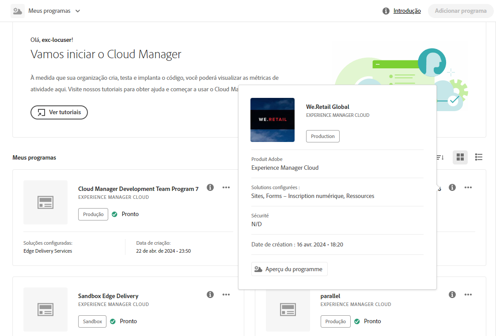

# Navegar pela interface do Cloud Manager {#navigation}

Saiba como a interface do Cloud Manager é organizada e como encontrar e gerenciar seus programas e ambientes.

A interface do Cloud Manager é composta principalmente por duas interfaces gráficas:

* [O console Meus programas](#my-programs-console), onde é possível exibir e gerenciar todos os seus programas.
* [A janela Visão geral do programa](#program-overview), onde é possível ver os detalhes e gerenciar um programa individual.

## Console Meus programas {#my-programs-console}

Ao fazer logon no Cloud Manager em [my.cloudmanager.adobe.com](https://my.cloudmanager.adobe.com/) e selecionar a organização apropriada, você acessará o console **Meus programas**.

O console Meus programas fornece uma visão geral de todos os programas aos quais você tem acesso na organização selecionada. Ele é composto por várias partes.

1. [Barras de ferramentas](#toolbars-my-programs-toolbars) para seleção de organização, alertas e configurações da conta
1. Guias que permitem alternar a exibição atual dos seus programas.
   * Exibição da **Página Inicial** (padrão) que seleciona a exibição de **Meus programas** com uma visão geral de todos os programas
   * **Licença** que acessa o painel de licenças. O painel de licenças aplica-se somente aos programas do AEM as a Cloud Service, não aos programas do AMS.
      * Para determinar o tipo de serviço que seu programa tem (AMS ou AEMaaCS), consulte a [seção Cartões de programa](#program-cards) deste documento.
   * Observe que o padrão das guias é fechado e pode ser revelado usando o menu de hambúrguer no [cabeçalho do Cloud Manager](#cloud-manager-header).
1. [Chamadas para ação e estatísticas](#cta-statistics) que fornecem uma visão geral das atividades recentes
1. Seção [**Meus programas**](#my-programs-section) que fornece uma visão geral de todos os seus programas
1. [Links rápidos](#quick-links) para acessar facilmente os recursos relacionados

>[!TIP]
>
>Consulte [Programas e Tipos de Programas](/help/getting-started/program-setup.md) para obter detalhes sobre programas.

### Barras de ferramentas {#my-programs-toolbars}

Há duas barras de ferramentas uma sobre a outra.

#### Cabeçalho do Cloud Manager {#cloud-manager-header}

A primeira é o cabeçalho do Cloud Manager, que permanece fixo ao navegar pelo Cloud Manager. Ele é uma âncora que dá acesso às configurações e informações que se aplicam aos programas do Cloud Manager.

1. O menu de opções que dá acesso às guias que podem levar a partes específicas de um programa individual ou alternar entre o painel de licenças e o console **[Meus programas](#my-programs-console)**, dependendo do contexto.
   * O painel de licenças aplica-se somente aos programas do AEM as a Cloud Service, não aos programas do AMS.
   * Para determinar o tipo de serviço que seu programa tem (AMS ou AEMaaCS), consulte a [seção Cartões de programa](#program-cards) deste documento.
1. O botão Cloud Manager leva de volta ao console Meus programas, independentemente de onde você estiver no Cloud Manager.
1. Clique no botão Feedback para fornecer feedback ao Adobe sobre o Cloud Manager.
1. O seletor de organização exibe a organização que você está utilizando no momento (neste exemplo, Foundation Internal). Clique em para alternar para outra organização se sua Adobe ID estiver associada a várias.
1. Clicar no alternador de soluções permite que você vá rapidamente para outras soluções Experience Cloud.
1. O ícone de ajuda fornece acesso rápido aos recursos de aprendizagem e suporte.
1. O ícone de notificações está marcado com o número de [notificações](/help/using/notifications.md) incompletas atribuídas atualmente
1. Clique no ícone que representa seu usuário para acessar as configurações de usuário. Se você não tiver uma imagem de usuário configurada, um ícone será atribuído aleatoriamente.

#### Barra de ferramentas do programa {#program-toolbar}

A barra de ferramentas do programa fornece links para alternar entre programas e ações do Cloud Manager adequados ao contexto.

1. O seletor de programas abre em uma lista suspensa na qual você pode selecionar outros programas rapidamente ou realizar ações apropriadas ao contexto, como criar um novo programa
1. O link de introdução fornece acesso à [jornada de integração à documentação](https://experienceleague.adobe.com/br/docs/experience-manager-cloud-service/content/onboarding/journey/overview) para que você possa começar a usar o Cloud Manager.
   * Observe que a jornada de integração foi projetada para o AEM as a Cloud Service e não para o Cloud Service para AMS, apesar de muitos conceitos serem os mesmos.
1. O botão de ação oferece ações adequadas ao contexto, como a criação de um novo programa.

### Chamadas para ação e estatísticas {#cta-statistics}

A seção de chamadas para ação e estatísticas fornece dados agregados para a sua organização. Por exemplo, se você tiver configurado os seus programas com êxito, será possível ver as estatísticas das suas atividades nos últimos 90 dias, incluindo:

* Número de [implantações](/help/using/code-deployment.md)
* Número de [problemas de qualidade de código](/help/using/code-quality-testing.md) identificados
* Número de builds

Ou se você estiver apenas começando a configurar a organização, encontrará dicas sobre as próximas etapas ou recursos de documentação.

### Seção “Meus programas” {#my-programs-section}

O conteúdo principal do console “Meus programas” é a seção **Meus programas**, que lista os seus programas como cartões individuais. Clique em um cartão para acessar a página **Visão geral do programa** do programa para obter detalhes sobre o programa.

>[!NOTE]
>
>Dependendo dos seus privilégios, talvez não seja possível selecionar determinados programas.

Use as opções de classificação para encontrar mais facilmente o programa necessário.

* Classificar por
   * Data de criação (padrão)
   * Nome do programa
   * Status
* Crescente (padrão)/Decrescente
* Exibição de grade (padrão)
* Exibição de lista

#### Cartões de programa {#program-cards}

Cada programa é representado por um cartão (ou linha em uma tabela), o qual fornece uma visão geral do programa e links rápidos para realizar ações.

* Imagem do programa (se configurada)
* Nome do programa
* Tipo de serviço:
   * **Experience Manager** para programas do AMS
   * **Experience Manager Cloud** para [programas do AEM as a Cloud Service](https://experienceleague.adobe.com/br/docs/experience-manager-cloud-service/content/implementing/home)
* Status
* Soluções configuradas
* Data de criação

O ícone de informações também fornece acesso rápido a informações adicionais sobre o programa (útil na exibição de lista).

O ícone de reticências fornece acesso a ações adicionais que você pode realizar no programa.

* Navegue até um determinado [ambiente](/help/using/managing-environments.md) do programa
* Abra a [visão geral do programa](#program-overview)
* [Editar o programa](/help/getting-started/program-setup.md)
* Mostrar monitoramento

### Links rápidos {#quick-links}

A seção de links rápidos fornece acesso aos recursos relacionados usados com frequência.

## Janela Visão geral do programa {#program-overview}

Depois de selecionar um programa no console [**Meus Programas**](#my-programs-console), você será direcionado para a Visão Geral do Programa.

A visão geral do programa fornece acesso a todos os detalhes de um programa do Cloud Manager. Assim como o console Meus programas, essa seção é composta de várias partes.

1. [Barras de ferramentas](#program-overview-toolbar) para voltar rapidamente ao console Meus Programas e navegar pelo programa
1. [Guias](#program-tabs) para alternar entre diferentes aspectos do programa
1. Uma [frase de chamariz](#cta) baseada nas últimas ações do programa
1. Uma [visão geral dos ambientes](#environments) do programa
1. Uma [visão geral dos pipelines](#pipelines) do programa
1. Links para [recursos úteis](#useful-resources)

### Barras de ferramentas {#program-overview-toolbar}

As barras de ferramentas para a visão geral do programa são muito semelhantes às do [console Meus Programas](#my-programs-toolbars). Somente as diferenças são ilustradas aqui.

#### Cabeçalho do Cloud Manager {#cloud-manager-header-2}

O cabeçalho do Cloud Manager tem um menu de opções que abre automaticamente para mostrar as guias navegáveis da visão geral do programa.

Clique no ícone de menu de hambúrguer para ocultar as guias.

#### Barra de ferramentas do programa {#program-toolbar-2}

A barra de ferramentas do programa ainda oferece acesso para alternar rapidamente para outros programas, mas também permite acessar ações adequadas ao contexto, como adicionar e editar o programa.

Além disso, a barra de ferramentas sempre mostra em qual guia você está se tiver optado por ocultar as guias usando o menu de opções.

### Guias do programa {#program-tabs}

Cada programa tem muitas opções e dados associados. Esses dados são coletados em guias para simplificar a navegação no programa. As guias fornecem acesso a:

* Visão geral: a visão geral do programa conforme descrito no documento atual
* [Atividade](/help/using/managing-pipelines.md#activity): o histórico de execuções de pipeline do programa
* [Pipelines](/help/using/managing-pipelines.md#pipelines): todos os pipelines configurados para o programa
* [Repositórios](/help/managing-code/managing-repositories.md): todos os repositórios configurados para o programa
* [Relatórios](/help/using/monitoring-environments.md#system-monitoring-overview): métricas, como dados de SLA
* [Ambientes](/help/using/managing-environments.md): todos os ambientes configurados para o programa
* [Conjuntos de conteúdo](/help/using/content-copy.md): conjuntos de conteúdo criados para fins de cópia
* [Atividade de cópia de conteúdo](/help/using/content-copy.md): atividades de cópia de conteúdo
* Caminhos de aprendizagem: recursos de aprendizagem adicionais sobre o Cloud Manager

Por padrão, ao abrir um programa, você acessa a guia **Visão geral**. A guia atual está realçada. Selecione outra guia para exibir seus detalhes.

Use o menu de opções no [cabeçalho do Cloud Manager](#cloud-manager-header-2) para ocultar as guias.

### Frase de chamariz {#cta}

A seção da frase de chamariz fornece informações úteis de acordo com o status do programa. Para um novo programa, você pode ver as próximas etapas oferecidas e um lembrete de uma data de ativação, [definida durante a criação do programa](/help/getting-started/program-setup.md).

No caso de um programa em tempo real, é possível ver o status da última implantação e links para obter detalhes e iniciar uma nova implantação.

### Cartão Ambientes {#environments}

O cartão **Ambientes** fornece uma visão geral de seus ambientes e links para ações rápidas.

O cartão **Ambientes** lista apenas três ambientes. Clique em **Mostrar tudo** para ver todos os ambientes do programa.

Consulte [Gerenciamento de ambientes](/help/using/managing-environments.md) para obter detalhes sobre como gerenciar os ambientes.

### Cartão Pipelines {#pipelines}

O cartão **Pipelines** fornece uma visão geral dos seus pipelines e links para ações rápidas.

O cartão **Pipelines** lista apenas três pipelines. Clique em **Mostrar tudo** para ver todos os pipelines do programa.

Consulte [Gerenciamento de pipelines](/help/using/managing-pipelines.md) para obter detalhes sobre como gerenciar seus pipelines.

### Recursos úteis {#useful-resources}

A seção **Recursos úteis** fornece links para recursos de aprendizado adicionais do Cloud Manager.
