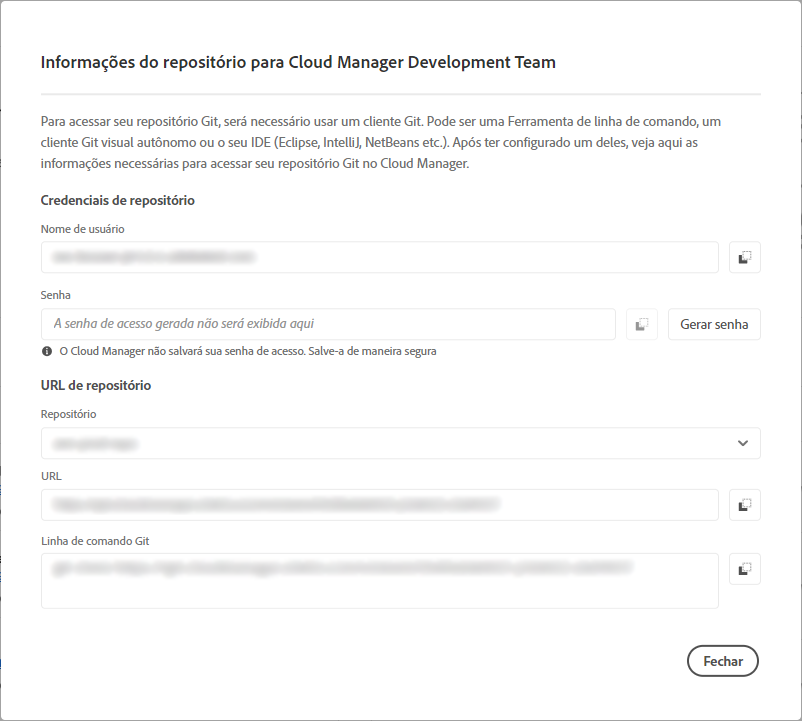

# Informações de acesso do repositório {#accessing-repos}

Saiba como acessar e gerenciar o repositório Git gerenciado pela Adobe usando o gerenciamento de conta Git por autoatendimento do Cloud Manager.

## Acessar informações do repositório na página Visão geral {#overview-page}

Com o Cloud Manager, você pode recuperar as informações de acesso do repositório para repositórios gerenciados pela Adobe usando as **Informações do Repositório de Acesso** do cartão **Pipelines**.

A caixa de diálogo **Informações do repositório** permite que você veja as seguintes informações de acesso para repositórios gerenciados pela Adobe:

* O nome de usuário do Git.
* A senha do Git.
* O URL do repositório Git do Cloud Manager.
* Comandos Git pré-criados para adicionar um remoto ao seu repositório Git e código de push.

  

O acesso a informações sobre [repositórios privados](/help/managing-code/private-repositories.md) não está disponível no Cloud Manager.

O recurso **Acessar informações do repositório** é visível para usuários com as funções de **Desenvolvedor** ou **Gerente de implantação**.

**Para acessar informações do repositório na página Visão geral:**

1. Faça logon no Cloud Manager em [my.cloudmanager.adobe.com](https://my.cloudmanager.adobe.com/) e selecione a organização e o programa apropriados.

1. Na página **Visão geral do programa**, no cartão **Pipelines**, clique em **Acessar informações do repositório**.

   

1. Para acessar a senha, você deve gerar uma nova senha. Na caixa de diálogo **Informações do repositório**, selecione **Gerar senha**.

1. Na caixa de diálogo de confirmação, selecione **Gerar senha**.

1. À direita do campo **Senha**, clique no  para copiar a senha para a área de transferência.

   * Gerar uma senha invalidará a senha anterior.
   * O Cloud Manager não salva a senha. É sua responsabilidade guardar esta senha com segurança.
   * Como o Cloud Manager não salva a senha, se você perdê-la, deverá gerar uma nova.

   

Usando essas credenciais, você pode clonar uma cópia local do repositório, fazer alterações nele e, quando pronto, enviar qualquer alteração de código de volta ao repositório de código remoto no Cloud Manager.

## Acesso a informações do repositório na janela Repositórios {#repositories-window}

O recurso **Acessar informações do repositório** também está disponível na página [**Repositórios**](/help/managing-code/managing-repositories.md). Ele exibe as mesmas informações sobre o acesso a repositórios gerenciados pela Adobe.

## Revogação de uma senha de acesso {#revoke-password}

É possível revogar uma senha de acesso a qualquer momento.

Para fazer isso, [crie um tíquete de suporte para esta solicitação](https://experienceleague.adobe.com/pt-br?support-solution=Experience+Manager&support-tab=home#support). O tíquete recebe alta prioridade e geralmente é resolvido em um dia.
