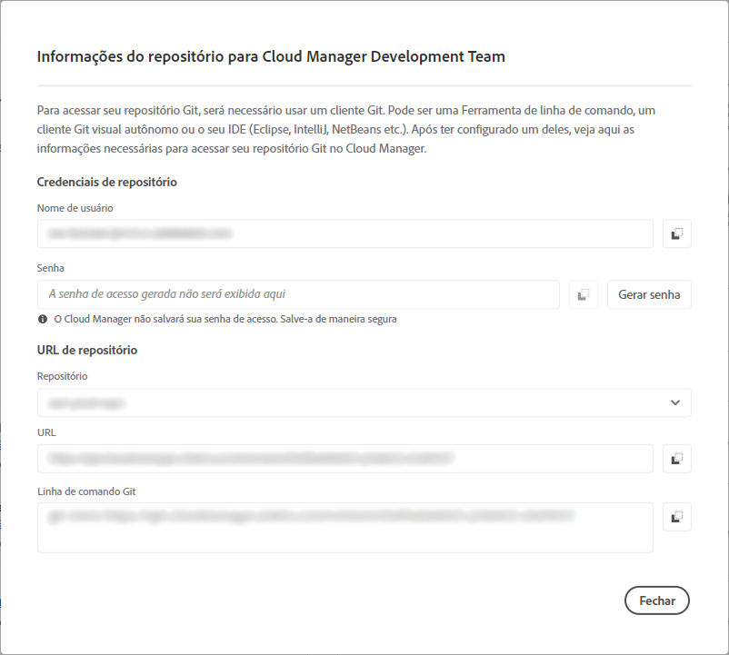

# Informações de acesso do repositório {#accessing-repos}

Saiba como acessar e gerenciar o repositório Git gerenciado pela Adobe usando o gerenciamento de conta Git por autoatendimento do Cloud Manager.

## Acessar informações do repositório na página Visão geral {#overview-page}

O Cloud Manager facilita a recuperação das informações de acesso do repositório para repositórios gerenciados pelo Adobe usando as **Acessar informações do repositório** do cartão **Pipelines**.

A caixa de diálogo **Informações do Repositório** permite que você veja as seguintes informações de acesso para repositórios gerenciados por Adobe:

* O nome de usuário do Git.
* A senha do Git.
* O URL do repositório Git do Cloud Manager.
* Comandos Git pré-construídos para adicionar rapidamente um controle remoto ao seu repositório Git e enviar código.

O acesso a informações sobre [repositórios privados](/help/managing-code/private-repositories.md) não está disponível no Cloud Manager.

O recurso **Acessar Informações do Repositório** está visível para usuários com as funções de **Desenvolvedor** ou **Gerente de Implantação**.

**Para acessar as informações do repositório na página Visão Geral:**

1. Faça logon no Cloud Manager em [my.cloudmanager.adobe.com](https://my.cloudmanager.adobe.com/) e selecione a organização e o programa apropriados.

1. Na página **Visão geral do programa**, no cartão **Pipelines**, clique em **Acessar informações do repositório**.

   

1. Para acessar a senha, uma nova senha deve ser gerada. Na caixa de diálogo **Informações do Repositório**, selecione **Gerar senha**.

1. Na caixa de diálogo de confirmação, selecione **Gerar senha**.

1. À direita do campo **Senha**, clique em  para copiar a senha para a área de transferência.

   * Gerar uma senha invalidará a senha anterior.
   * O Cloud Manager não salva a senha. É sua responsabilidade salvar a senha com segurança.
   * Como o Cloud Manager não salva a senha, se você perdê-la, deverá gerar novamente uma nova senha.

   

Usando essas credenciais, o usuário pode clonar uma cópia local do repositório e fazer alterações nele, e quando pronto, pode confirmar qualquer alteração no repositório de códigos remotos no Cloud Manager.

## Acesso a informações do repositório na janela Repositórios {#repositories-window}

O recurso **Acessar Informações do Repositório** também está disponível na página [**Repositórios**](/help/managing-code/managing-repositories.md). Ele exibe as mesmas informações sobre o acesso a repositórios gerenciados pela Adobe.

## Revogação de uma senha de acesso {#revoke-password}

Você pode revogar uma senha de acesso a qualquer momento.

Para fazer isso, [crie um tíquete de suporte para esta solicitação](https://experienceleague.adobe.com/pt-br?support-solution=Experience+Manager&amp;support-tab=home#support). O ticket é tratado com alta prioridade e geralmente é revogado dentro de um dia.
