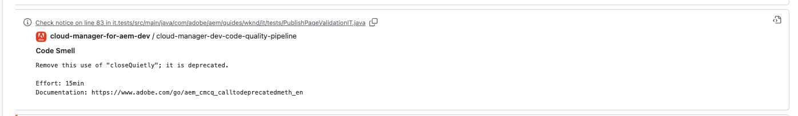

# Anotações de verificação do GitHub {#github-annotations}

Saiba como o GitHub verifica as PRs de anotação de seus repositórios privados para fornecer feedback.

## Visão geral {#overview}

Se você usa [repositórios privados](private-repositories.md) para seu programa Cloud Manager, o verifica no GitHub é executado automaticamente para cada solicitação de pull. Essas verificações são anotadas com informações para ajudar você a identificar problemas com seu código o mais rápido possível.

Os problemas de [qualidade do código](/help/using/code-quality-testing.md) detectados pelo [SonarQube](/help/using/custom-code-quality-rules.md) estão claramente listados.

A linha exata de código com o problema é fornecida e você pode selecioná-la para exibir o código relevante. Essas anotações são fornecidas para todos os problemas de código, não apenas aqueles na solicitação de pull.

Todas as linhas anotadas são agregadas na guia **Arquivos alterados** na solicitação de pull do GitHub. As anotações de arquivos não alterados na solicitação de pull aparecem em uma seção separada.

## Pipelines da qualidade de código {#code-quality-pipelines}

Os resultados [Qualidade do código](/help/using/code-quality-testing.md) também estão visíveis no pipeline, que o Cloud Manager aciona automaticamente, na parte inferior da guia **Verificações**. Também é acessível por meio dos **Detalhes** da verificação da solicitação de pull.

Você também pode visualizar os problemas como um arquivo CSV. Você pode acessar essas informações [vendo os detalhes da execução do pipeline no Cloud Manager](/help/using/managing-pipelines.md).
