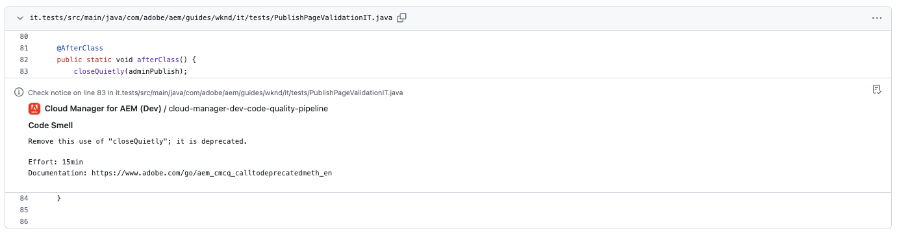

# Anotações de verificação do GitHub {#github-annotations}

Saiba como o GitHub verifica PRs anotados em seus repositórios privados para fornecer um feedback útil.

## Visão geral {#overview}

Se você usa [repositórios privados](private-repositories.md) para seu programa Cloud Manager, o verifica no GitHub é executado automaticamente para cada solicitação de pull. Essas verificações são anotadas com informações úteis para ajudar a entender os problemas com seu código o mais rápido possível.

Os problemas de [qualidade do código](/help/using/code-quality-testing.md) detectados pelo [SonarQube](/help/using/custom-code-quality-rules.md) estão claramente listados.

A linha exata de código com o problema é fornecida, permitindo clicar para mostrar o código relevante. Essas anotações são fornecidas para todos os problemas de código, não apenas aqueles alterados na solicitação de pull.

Todas as linhas anotadas são agregadas na guia **Arquivos alterados** na solicitação de pull do GitHub. As anotações de arquivos que não foram alterados na solicitação de pull aparecem em sua própria seção.

## Pipelines da qualidade de código {#code-quality-pipelines}

Os resultados da [qualidade do código](/help/using/code-quality-testing.md) também são visíveis no pipeline que é acionado automaticamente pelo Cloud Manager na parte inferior da guia **Verificações**. Também é acessível nos **Detalhes** da verificação da solicitação de pull.

Também é possível visualizar os problemas no formato CSV. Este método pode ser recuperado [visualizando os detalhes da execução do pipeline no Cloud Manager](/help/using/managing-pipelines.md).
