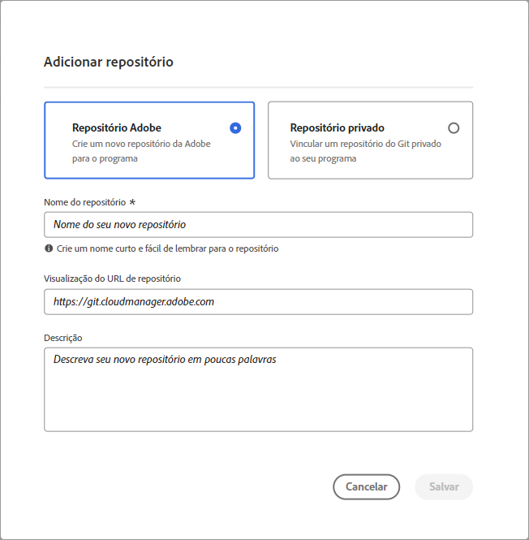
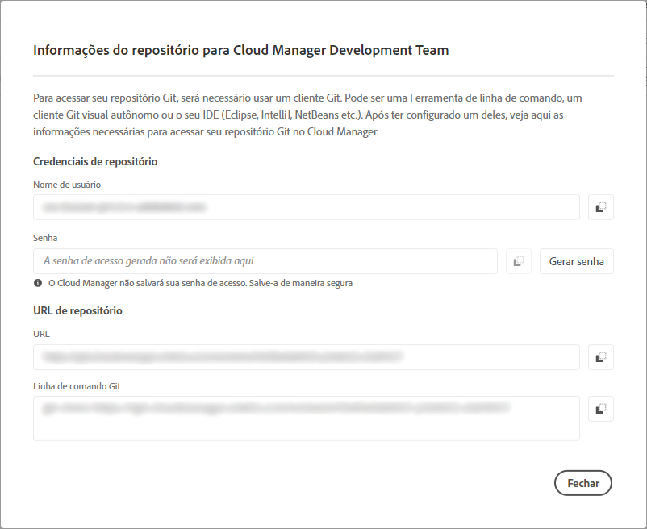
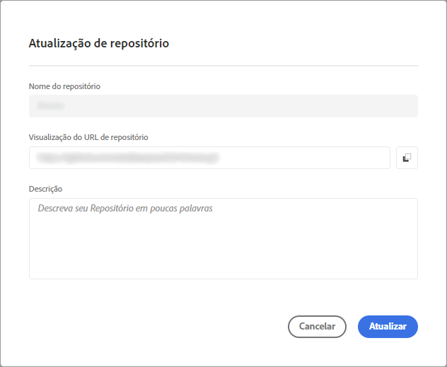

# Gerenciar repositórios no Cloud Manager {#cloud-manager-repos}

Saiba como visualizar, adicionar e excluir um repositório Git no Cloud Manager.

## Visão geral {#overview}

Os repositórios no Cloud Manager são usados para armazenar e gerenciar o código do projeto usando o Git. Para cada *programa* adicionado, um repositório gerenciado por Adobe é automaticamente criado.

Além disso, você tem a opção de criar mais repositórios gerenciados por Adobe ou adicionar seus próprios repositórios privados. Todos os repositórios vinculados ao seu programa podem ser exibidos na página **Repositórios**.

Os repositórios criados no Cloud Manager também podem ser selecionados ao adicionar ou editar pipelines. Para obter mais informações sobre como configurar pipelines, consulte [Pipelines de CI-CD](/help/overview/ci-cd-pipelines.md).

Cada pipeline está vinculado a um repositório ou ramificação principal. No entanto, com o [suporte ao submódulo Git](/help/managing-code/git-submodules.md), várias ramificações secundárias podem ser incluídas durante o processo de compilação.

## Exibir a página Repositórios {#repositories-window}

Na página **Repositórios**, você pode exibir detalhes sobre o repositório selecionado. Essas informações incluem o tipo de repositório em uso. Se o repositório estiver marcado como **Adobe**, indica que é um repositório gerenciado por Adobe. Se estiver rotulado como **GitHub**, ele se refere a um repositório GitHub privado que você gerencia. Além disso, a página fornece detalhes como quando o repositório foi criado e os pipelines associados a ele.

Para executar ações em um repositório selecionado, clique nele e use o  para abrir um menu suspenso. Para repositórios gerenciados por Adobe, você pode **[Verificar ramificações/Criar projeto](#check-branches)**.

*Menu suspenso na página Repositórios.*

Outras ações disponíveis no menu suspenso incluem **[Copiar URL do repositório](#copy-url)**, **[Exibir e atualizar](#view-update)** e **[Excluir](#delete)** o repositório.

**Para exibir a página Repositórios:**

1. Faça logon no Cloud Manager em [my.cloudmanager.adobe.com](https://my.cloudmanager.adobe.com/) e selecione a organização e o programa apropriados.

1. Na página **Visão geral do programa**, no menu lateral, clique em  **Repositórios**.

1. A página **Repositórios** exibe todos os repositórios associados ao programa selecionado.

   
   *A página Repositórios no Cloud Manager.*

## Adicionar um repositório {#adding-repositories}

O usuário deve ter a função **Gerente de implantação** ou **Proprietário da empresa** para adicionar um repositório.

Na página **Repositórios**, próximo ao canto superior direito, clique em **Adicionar repositório**

*Caixa de diálogo Adicionar Repositório.*

A Cloud Manager oferece suporte a dois tipos de repositórios: repositórios gerenciados por Adobe (**Repositório Adobe**) e repositórios gerenciados automaticamente (**Repositório privado**). Os campos obrigatórios para configuração variam de acordo com o tipo de repositório que você escolhe adicionar. Para obter mais informações, consulte o seguinte:

* [Adicionar repositórios privados no Cloud Manager](/help/managing-code/adobe-repositories.md)
* [Adição de repositórios privados no Cloud Manager](/help/managing-code/private-repositories.md)

Há um limite de 300 repositórios em todos os programas em uma determinada empresa ou organização IMS.

## Acessar informações do repositório {#repo-info}

Ao visualizar os repositórios na janela **Repositórios**, você pode visualizar os detalhes sobre como acessar os repositórios gerenciados pela Adobe de forma programática clicando no botão **Acessar informações do repositório** na barra de ferramentas.

A janela **Informações do repositório** é aberta com os detalhes. Para obter mais informações sobre o acesso às informações do repositório, consulte o documento [Acessar informações do repositório](/help/managing-code/accessing-repositories.md).

## Verificar ramificações/Criar projeto {#check-branches}

No **AEM Cloud Manager**, a ação **Verificar Ramificações/Criar Projeto** serve a duas finalidades, dependendo do estado atual do repositório.

* Se o repositório for recém-criado, essa ação gerará um projeto de amostra usando o [arquétipo de projeto AEM](https://experienceleague.adobe.com/pt-br/docs/experience-manager-core-components/using/developing/archetype/overview).
* Se o projeto de amostra já tiver sido criado no repositório, a ação verificará o status do repositório e suas ramificações, fornecendo feedback sobre se o projeto de amostra já existe.

  

## Copiar URL de repositório {#copy-url}

A ação **Copiar URL do Repositório** copia a URL do repositório selecionado na página **Repositórios** para a área de transferência a ser usada em outro lugar.

## Exibir e atualizar um repositório {#view-update}

A ação **Exibir e Atualizar** abre a caixa de diálogo **Atualizar Repositório**, onde você pode exibir o **Nome** e a **visualização da URL do repositório**. Além disso, permite atualizar a **Descrição** do repositório.

## Excluir um repositório {#delete}

A ação **Excluir** remove o repositório do seu projeto. Um repositório não pode ser excluído se estiver associado a um pipeline.

Quando um repositório é excluído no Cloud Manager, ele é marcado como excluído e não fica mais acessível ao usuário. No entanto, ele continua no sistema para fins de recuperação.

Se você tentar criar um novo repositório depois de excluir um com o mesmo nome, receberá a seguinte mensagem de erro:

`An error has occurred while trying to create repository. Contact your CSE or Adobe Support.`

Se você receber essa mensagem de erro, entre em contato com o Suporte do Adobe. Eles podem ajudá-lo a renomear o repositório excluído ou escolher um nome diferente para o novo repositório.
