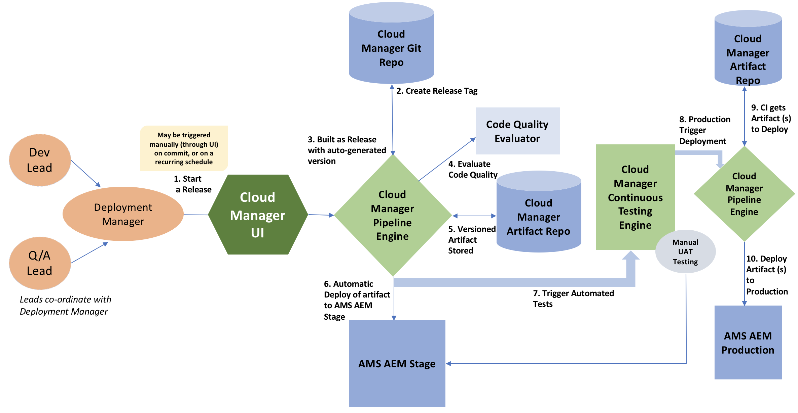
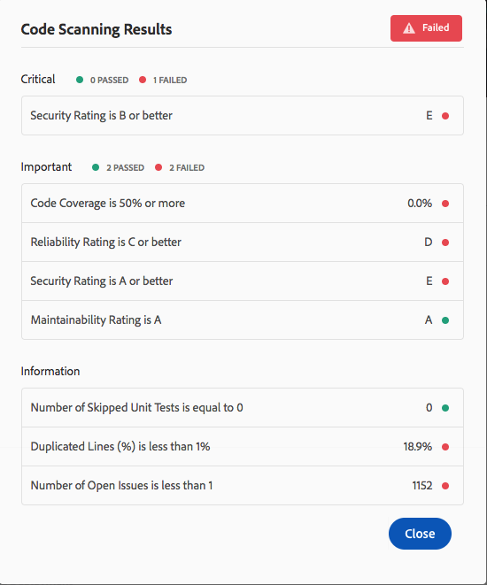

# Pipeline de CI/CD {#ci-cd-pipeline}

## Visão geral do pipeline {#pipeline-overview}

[!UICONTROL Cloud Manager] O inclui uma estrutura de Integração contínua (CI) e Entrega contínua (CD) que permite que as equipes de implementação testem e entreguem rapidamente códigos novos ou atualizados. Por exemplo, as equipes de implementação podem configurar, configurar e iniciar um pipeline de CI/CD automatizado que utiliza as práticas recomendadas de codificação de Adobe para executar uma verificação completa de código e garantir a mais alta qualidade do código.

O pipeline de CI/CD também automatiza processos de teste de unidade e desempenho para aumentar a eficiência da implantação e identificar proativamente problemas críticos que são caros de corrigir após a implantação. As equipes de implementação podem acessar um relatório abrangente de desempenho de código para obter visibilidade sobre o impacto potencial em KPIs e validações críticas de segurança se o código for implantado na produção.

## Processo de pipeline {#pipeline-process}

O diagrama a seguir ilustra o que acontece quando uma versão é acionada em [!UICONTROL Cloud Manager]. A tabela de acompanhamento explica cada etapa do fluxo de trabalho.

A tabela a seguir detalha o que está acontecendo durante cada etapa do processo:

| Etapa do processo de pipeline | O que está acontecendo? |
|---|---|
| 1. Inicie uma versão | Um gerente de implantação aciona uma versão manualmente, com uma confirmação de Git ou com base em uma programação recorrente. |
| 2. Criar tag de lançamento | [!UICONTROL Cloud Manager] cria uma tag Git para marcar a versão usando um número de versão gerado automaticamente. Por exemplo: 2018.531.245527.00000122 |
| 3. Versão criada como gerada automaticamente | [!UICONTROL Cloud Manager] O cria o aplicativo com o número de versão atribuído recentemente. |
| 4. Avaliar a qualidade do código | [!UICONTROL Cloud Manager] verifica o código-fonte e fornece um resumo antes que o código possa ser implantado no ambiente de preparo |
| 5. Artefato(s) de versão armazenado(s) | Os artefatos de versão são armazenados para uso posterior nas etapas de implantação. |
| 6. Implantação automática de artefatos no AMS AEM Estágio | O artefato de versão é implantado no ambiente de preparo. |
| 7. Acionar testes automatizados | [!UICONTROL Cloud Manager] executa os testes de desempenho e segurança no artefato. |
| 8. Implantação do acionador de produção | Após a conclusão dos testes automatizados, [!UICONTROL Cloud Manager] inicia a implantação para produção. |
| 9. [!UICONTROL Cloud Manager] obtém Artefatos para Implantar | [!UICONTROL Cloud Manager] extrai os artefatos de versão armazenados. |
| 10. Aplique artefatos à produção | Os artefatos da versão são implantados no ambiente Produção. |

### Como configurar um pipeline de CI/CD {#how-to-setup-a-ci-cd-pipeline}

Para saber mais sobre a configuração de pipeline, consulte [configurando pipeline](configuring-pipeline.md).

## Portas de qualidade {#quality-gates}

O pipeline de CI/CD fornece portas de qualidade ou critérios de aceitação, que devem ser atendidos antes que o código possa ser movido do ambiente de preparo para o ambiente de implantação. Há três portas no pipeline:

* Qualidade do código
* Teste de desempenho
* Teste de segurança

Para cada uma dessas portas, há três níveis de problemas identificados:

* **Crítico**  - problemas identificados pela porta que causam uma falha imediata do pipeline.
* **Importante**  - problemas identificados pela porta que fazem com que o pipeline entre em um estado pausado. Um gerente de implantação, gerente de projeto ou proprietário de negócios pode substituir os problemas, caso o pipeline continue, ou pode aceitar os problemas, caso o pipeline pare com uma falha.
* **Informações**  - questões identificadas pela porta que são fornecidas apenas para fins informativos e não têm impacto na execução do pipeline.

Este é um exemplo de uma verificação de código com problemas identificados para o código:

### Como configurar portas {#how-to-setup-gates}

Consulte **[Configuração de portões](configuring-pipeline.md)** para obter detalhes sobre a configuração do código, da qualidade e das portas de desempenho.
