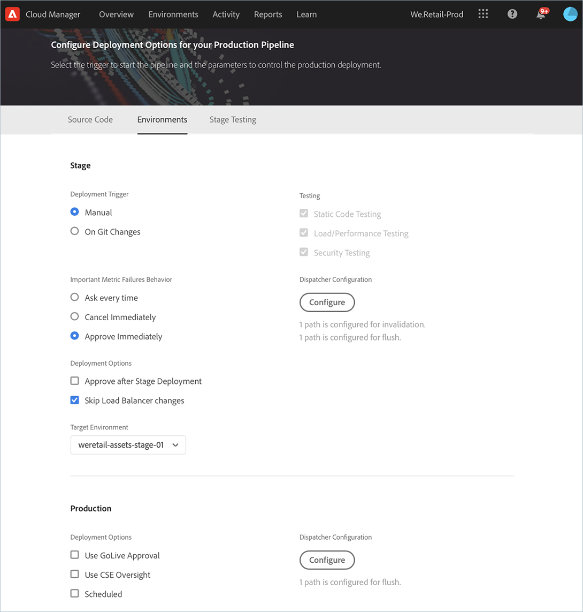
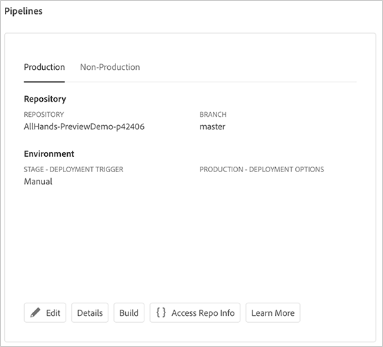

# Configurar o pipeline de CI/CD {#configure-your-ci-cd-pipeline}

>[!NOTE]
>Para saber como configurar o pipeline de CI/CD para o Cloud Manager no AEM como um Cloud Service, consulte [aqui](https://experienceleague.adobe.com/docs/experience-manager-cloud-service/implementing/using-cloud-manager/configure-pipeline.html?lang=en#using-cloud-manager).

A página a seguir explica como configurar o **Pipeline**. Para analisar mais informações conceituais sobre como o pipeline funciona, consulte a [Visão geral do pipeline de CI/CD](ci-cd-pipeline.md).

## Tutorial em vídeo {#video-tutorial-one}

### Configuração do pipeline no Cloud Manager {#config-pipeline-video}

A configuração do pipeline de produção de CI/CD define o acionador que iniciará o pipeline, parâmetros que controlam a implantação de produção e parâmetros de teste de desempenho.

>[!VIDEO](https://video.tv.adobe.com/v/26314/)

## Como entender o fluxo {#understanding-the-flow}

Você pode configurar o pipeline no bloco **Configurações de pipeline** na interface do usuário do [!UICONTROL Cloud Manager].

O Gerenciador de implantação é responsável pela configuração do pipeline. Ao fazer isso, primeiro selecione uma ramificação do **Repositório Git**. A configuração do pipeline consiste em:

* definindo o acionador que iniciará o pipeline.
* definição dos parâmetros que controlam a implantação de produção.
* configuração dos parâmetros de teste de desempenho.

## Configuração do pipeline {#setting-up-the-pipeline}

>[!CAUTION]
>
>O pipeline não pode ser configurado até que o repositório Git tenha pelo menos uma ramificação e [Configuração do Programa](setting-up-program.md) seja concluído.

Antes de começar a implantar seu código, você deve definir as configurações de pipeline do [!UICONTROL Cloud Manager].

>[!NOTE]
>
>Você pode alterar as configurações do pipeline após a configuração inicial.

### Definição das configurações de pipeline de [!UICONTROL Cloud Manager] {#configuring-the-pipeline-settings-from-cloud-manager}

Depois de configurar seu programa usando a interface [!UICONTROL Cloud Manager], você estará pronto para configurar seu pipeline.

Siga estas etapas para configurar o comportamento e as preferências do pipeline:

1. Clique em **Configurar pipeline** para configurar seu pipeline.

   

1. A tela **Configurar pipeline** é exibida.

   O assistente de três etapas permite configurar o ambiente **Ramificação**, **Ambientes** e **Teste**.
Selecione a ramificação Git e clique em **Next**.

   >[!NOTE]
   >
   >As ramificações encontradas no repositório Git são vinculadas ao seu programa.

1. Acesse a guia **Ambientes** para selecionar as opções **Estágio** e **Produção**.

   Você pode definir o acionador para iniciar o pipeline:

   * **Em alterações no Git**  - inicia o pipeline de CI/CD sempre que há confirmações adicionadas à ramificação git configurada. Mesmo que você selecione essa opção, sempre poderá iniciar o pipeline manualmente.
   * **Manual**  - uso da interface do usuário para iniciar manualmente o pipeline.

   Durante a configuração ou edição do pipeline, o Gerenciador de implantação tem a opção de definir o comportamento do pipeline quando uma falha importante for encontrada em qualquer uma das portas de qualidade, como Qualidade de código, Teste de segurança e Teste de desempenho.

   Isso é útil para clientes que desejam processos mais automatizados. As opções disponíveis são:

* **Perguntar sempre**  - Essa é a configuração padrão e requer intervenção manual em qualquer falha importante.
* **Cancelar imediatamente**  - se selecionado, o pipeline será cancelado sempre que ocorrer uma falha importante. Isso é basicamente emular um usuário que rejeita manualmente cada falha.
* **Aprovar imediatamente**  - Se selecionado, o pipeline continuará automaticamente sempre que ocorrer uma falha importante. Isso é basicamente emular um usuário que aprova manualmente cada falha.

   Agora você define os parâmetros que controlam a implantação de produção. As três opções disponíveis são as seguintes:

* **Uso de Aprovação em tempo real**  - uma implantação deve ser aprovada manualmente por um proprietário de negócios, gerente de projeto ou gerente de implantação por meio da  [!UICONTROL Cloud Manager] interface do usuário.
* **Use a Supervisão de CSE**  - Um CSE é engajado para realmente iniciar a implantação. Durante a configuração do pipeline ou edite quando o CSE Oversight estiver ativado, o Gerenciador de implantação tem a opção de selecionar:

   * **Qualquer caso**: refere-se a qualquer caso disponível
   * **Meu caso**: se refere a um CSE específico atribuído ao cliente ou ao backup, se o CSE estiver fora do escritório

* **Scheduled**  - essa opção permite que o usuário habilite a implantação de produção agendada.

>[!NOTE]
>Se a opção **Scheduled** estiver selecionada, você poderá agendar a implantação de produção para o pipeline **depois de** a implantação do palco (e **Use GoLive Approval**, se isso tiver sido ativado) para aguardar a definição de um agendamento. O usuário também pode optar por executar a implantação de produção imediatamente.
>
>Consulte [**Implante o Código**](deploying-code.md) para definir o agendamento de implantação ou executar a produção imediatamente.

>[!NOTE]
>
>A opção **Use CSE Oversight** não está disponível para todos os clientes.

**Aprovar após implantação do estágio**

Há uma etapa opcional **Aprovar após a implantação de preparo** que pode ser configurada no pipeline de produção.
Isso é ativado em uma nova opção na tela **Edição de pipeline**:

Ele é mostrado como uma etapa separada durante a execução do pipeline:

>[!NOTE]
>
>**Aprovar após a** Implantação do Estágio funciona de forma semelhante à aprovação antes da implantação de produção, mas ocorre imediatamente após a etapa de implantação do estágio, ou seja, antes que qualquer teste seja feito, em comparação com a aprovação antes da implantação de produção, que é feita após a conclusão de todos os testes.

**Invalidação do Dispatcher**

Como um Gerenciador de implantação, você tem a oportunidade de configurar um conjunto de caminhos de conteúdo que serão **invalidados** ou **liberados** do cache do Dispatcher AEM para instâncias de publicação, enquanto configura ou edita o pipeline.

Você pode configurar um conjunto separado de caminhos para a implantação de Preparo e Produção. Se configuradas, essas ações de cache serão executadas como parte da etapa do pipeline de implantação, logo após a implantação de qualquer pacote de conteúdo. Essas configurações usam o comportamento padrão AEM do Dispatcher - a invalidação executa uma invalidação de cache, de modo semelhante a quando o conteúdo é ativado do autor para publicação; flush executa uma exclusão de cache.

Em geral, o uso da ação de invalidação é preferível, mas pode haver casos em que a liberação é necessária, especialmente ao usar AEM bibliotecas de clientes HTML.

>[!NOTE]
>
>Consulte [Visão geral do Dispatcher](dispatcher-configurations.md) para obter mais informações sobre o armazenamento em cache do Dispatcher.

Siga as etapas abaixo para configurar as Invalidações do Dispatcher:

1. Clique em **Configurar** no cabeçalho Configuração do Dispatcher

   

1. Insira o caminho, selecione a ação de **Type** e clique em **Add**. Você pode especificar até 100 caminhos por ambiente. Depois de adicionar os caminhos, clique em **Apply**.

   

1. Quando voltar à página **Configurações do pipeline**, você verá um resumo atualizado das seleções.

   Clique em **Save** para manter essa configuração.

   

1. Acesse a guia **Testing** para definir os critérios de teste para o seu programa. Agora você pode configurar os parâmetros de teste de desempenho.

   Você pode configurar os *AEM Sites* e *AEM Assets* Testes de Desempenho, dependendo dos produtos que você licenciou. Consulte [Teste de desempenho](understand-your-test-results.md#performance-testing) para obter mais detalhes.

1. Clique em **Save** para concluir a configuração do processo de pipeline.

   >[!NOTE]
   >Além disso, depois de configurar o pipeline, você ainda poderá editar as configurações para o mesmo usando o bloco **Configurações do pipeline de produção** da interface do usuário [!UICONTROL Cloud Manager].

   

## Pipelines somente para não-produção e qualidade de código

Além do pipeline principal que é implantado na fase e na produção, os clientes podem configurar pipelines adicionais, conhecidos como **Non-Production Pipelines**. Esses pipelines sempre executam as etapas de criação e qualidade do código. Como opção, também podem implantar no ambiente do Adobe Managed Services.

## Tutorial em vídeo {#video-tutorial-two}

### Pipelines do Cloud Manager que não são de produção e qualidade de código {#non-prod-video}

CI/CD Os pipelines de não produção são divididos em duas categorias, pipelines de qualidade de código e pipelines de implantação. O código de pipelines de qualidade todos os códigos de uma ramificação Git para criar e ser avaliado em relação à verificação de qualidade do código do Cloud Manager.

>[!VIDEO](https://video.tv.adobe.com/v/26316/)

Na tela inicial, esses pipelines são listados em um novo cartão:

1. Acesse o bloco **Pipelines de não produção** na tela inicial do Cloud Manager.

   

1. Clique no botão **Add** para especificar o Nome do pipeline, o Tipo de pipeline e a Ramificação Git.

   Além disso, também é possível configurar o Acionador de implantação e o Comportamento de falha importante nas Opções de pipeline.

   

1. Clique em **Save** e o pipeline é mostrado no cartão na tela inicial com cinco ações:

   * **Editar**  - permite editar as configurações de pipeline
   * **Detalhes**  - exibe a última execução do pipeline (se houver um)
   * **Build**  - navega até a página de execução, da qual o pipeline pode ser executado
   * **Acessar informações do acordo de recompra**  - permite que o usuário obtenha as informações necessárias para acessar o repositório Git do Cloud Manager
   * **Saiba mais**  - navegue para entender o recurso de documentação do pipeline de CI/CD.

      
   >[!NOTE]
   >
   >Enquanto o pipeline está em execução, a etapa atual é exibida e somente a ação **Details** está disponível.

## Próximas etapas {#the-next-steps}

Depois de configurar o pipeline, é necessário implantar seu código.

Consulte [Implantar o código](deploying-code.md) para obter mais detalhes.
