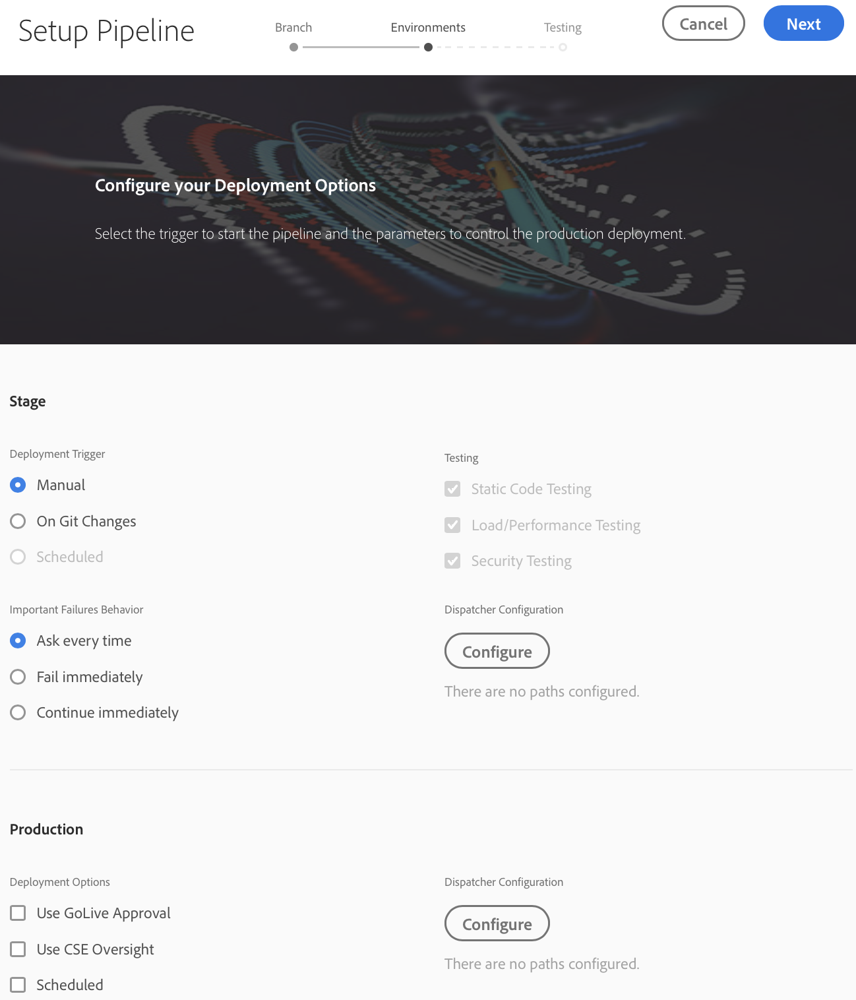
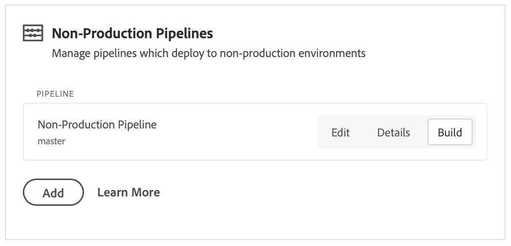

# Configure seu pipeline CI/CD {#configure-your-ci-cd-pipeline}

A página a seguir explica como configurar o **Pipeline**. Para consultar mais informações conceituais sobre como o pipeline funciona, consulte a visão geral [do pipeline de](ci-cd-pipeline.md)IC/CD.

## Como entender o fluxo {#understanding-the-flow}

Você pode configurar seu pipeline a partir do bloco Configurações **de** pipeline na [!UICONTROL Cloud Manager] interface do usuário.

O Gerenciador de implantação é responsável pela configuração do pipeline. Ao fazer isso, selecione primeiro uma ramificação do Repositório **Git**. A configuração do pipeline consiste em:

* definindo o acionador que iniciará o pipeline.
* definição dos parâmetros que controlam a implantação de produção.
* configuração dos parâmetros de teste de desempenho.

## Configuração do pipeline {#setting-up-the-pipeline}

>[!CAUTION]
>
>O pipeline não pode ser configurado até que o repositório Git tenha pelo menos uma ramificação e a Configuração  do programa esteja concluída.

Antes de começar a implantar seu código, você deve definir as configurações de pipeline do [!UICONTROL Cloud Manager].

>[!NOTE]
>
>É possível alterar as configurações do pipeline após a configuração inicial.

### Configurar as configurações de pipeline de [!UICONTROL Cloud Manager]{#configuring-the-pipeline-settings-from-cloud-manager}

Depois de configurar seu programa usando a [!UICONTROL Cloud Manager] interface do usuário, você estará pronto para configurar seu pipeline.

Siga estas etapas para configurar o comportamento e as preferências do seu pipeline:

1. Clique em **Configurar pipeline** para configurar e configurar seu pipeline.

   

1. A tela **Setup Pipeline (Instalar pipeline** ) é exibida.

   O assistente de três etapas permite que você configure seu ambiente **Branch**, **Environments** e **Testing** .
Selecione a ramificação Git e clique em **Avançar**.

   >[!NOTE]
   >
   >As ramificações encontradas no repositório Git estão vinculadas ao seu programa.

   

1. Acesse a guia **Ambientes** para selecionar as opções **Estágio** e **Produção** .

   Você pode definir o acionador para iniciar o pipeline:

   * **On Git Changes** (Alterações no Git) - inicia o pipeline de CI/CD sempre que houver confirmações adicionadas à ramificação git configurada. Mesmo se você selecionar essa opção, sempre poderá iniciar o pipeline manualmente.
   * **Manual** - usar a interface de usuário para iniciar manualmente o pipeline.
   * **Programada** - esta opção estará disponível em breve em uma versão futura.
   Durante a configuração ou edição do pipeline, o Gerenciador de implantação tem a opção de definir o comportamento do pipeline quando uma falha importante for encontrada em qualquer uma das portas de qualidade, como Qualidade de código, Teste de segurança e Teste de desempenho.

   Isso é útil para clientes que desejam processos mais automatizados. As opções disponíveis são:

* **Perguntar sempre** - Essa é a configuração padrão e requer intervenção manual em qualquer falha importante.
* **Falha imediatamente** - se selecionado, o pipeline será cancelado sempre que ocorrer uma falha importante. Isso é essencialmente emular um usuário rejeitando manualmente cada falha.
* **Continuar imediatamente** - Se selecionado, o pipeline continuará automaticamente sempre que ocorrer uma falha importante. Isso é essencialmente emular um usuário que aprova manualmente cada falha.

   Agora você define os parâmetros que controlam a implantação de produção. As três opções disponíveis são as seguintes:

* **Usar aprovação** em tempo real - uma implantação deve ser aprovada manualmente por um proprietário comercial, gerente de projeto ou gerente de implantação por meio da [!UICONTROL Cloud Manager] interface do usuário.
* **Usar a Supervisão** de CSE - Um CSE está envolvido para realmente iniciar a implantação. Durante a configuração de pipeline ou edição quando a Superintendência CSE estiver ativada, o Gerenciador de Implantação tem a opção de selecionar:

   * **Qualquer caso**: refere-se a qualquer CSE disponível
   * **Meu CSE**: refere-se a um CSE específico atribuído ao cliente ou a seu backup, se o CSE estiver fora do escritório

* **Programado** - Essa opção permite que o usuário ative a implantação de produção programada.

>[!NOTE]
>
>Se a opção **Agendado** estiver selecionada, você poderá programar a implantação de produção para o pipeline **após** a implantação do estágio (e **Usar aprovação** em tempo real, se isso tiver sido ativado) aguardar a definição de uma programação. O usuário também pode optar por executar a implantação de produção imediatamente.
>
>Consulte [**Implantar seu código**](deploying-code.md)para definir a programação de implantação ou executar a produção imediatamente.

>[!NOTE]
>
>A opção **Usar Supervisão** de CSE não está disponível para todos os clientes.

**Invalidação do Dispatcher**

Como um Gerenciador de implantação, você tem a oportunidade de configurar um conjunto de caminhos que serão **invalidados** ou **liberados** do cache do AEM Dispatcher, ao configurar ou editar o pipeline.

Você pode configurar um conjunto separado de caminhos para a implantação de Estágio e Produção. Se configurado, essas ações de cache serão executadas como parte da etapa do pipeline de implantação, logo após a implantação de qualquer pacote de conteúdo. Essas configurações usam o comportamento padrão do AEM Dispatcher - a invalidate executa uma invalidação de cache, semelhante a quando o conteúdo é ativado do autor para publicar; flush executa uma exclusão de cache.

Em geral, o uso da ação de invalidação é preferível, mas pode haver casos em que a limpeza é necessária, especialmente ao usar as bibliotecas do cliente AEM HTML.

>[!NOTE]
>
>Consulte Visão geral [do](dispatcher-configurations.md) Dispatcher para obter mais informações sobre o armazenamento em cache do Dispatcher.

Siga as etapas abaixo para configurar as validações do Dispatcher:

1. Clique em **Configurar** no cabeçalho Configuração do Dispatcher

   

1. Insira o caminho, selecione a ação do **Tipo** e clique em **Adicionar**. É possível especificar até 100 caminhos por ambiente. Depois de adicionar os caminhos, clique em **Aplicar**.

   

1. Quando voltar à página Configurações **do** pipeline, você verá um resumo atualizado das seleções.

   Clique em **Salvar** para persistir nesta configuração.

   

   **Aprovar após implantação** do estágioHá uma etapa opcional **Aprovar após implantação** do estágio que pode ser configurada no pipeline de produção.
Isso está ativado em uma nova opção na tela Edição **de** Pipeline:

   

   Em seguida, é mostrado como uma etapa separada durante a execução do pipeline:
   

   >[!NOTE]
   >
   >**Aprovar após a implantação** do estágio funciona de forma semelhante à aprovação antes da implantação da produção, mas ocorre imediatamente após a etapa de implantação do estágio, ou seja, antes que qualquer teste seja feito, comparado com a aprovação antes da implantação da produção, que é feita após a conclusão de todos os testes.

1. Acesse a guia **Teste** para definir seus critérios de teste para o programa.

   Agora, você pode configurar os parâmetros de teste de desempenho.

   Você pode configurar o teste de desempenho do *AEM Sites* e do *AEM Assets* , dependendo dos produtos licenciados.

   **AEM Sites:**

   O Cloud Manager executa testes de desempenho para programas do AEM Sites, solicitando páginas (como um usuário não autenticado) no servidor de publicação do palco por um período de teste de 30 minutos e medindo o tempo de resposta de cada página, bem como várias métricas no nível do sistema.As páginas são selecionadas por três conjuntos **de** páginas; você pode escolher em qualquer lugar de um a todos os três conjuntos. A distribuição do tráfego se baseia no número de conjuntos selecionados, ou seja, se todos os três forem selecionados, 33% do total de exibições de página serão colocadas em cada conjunto; se dois forem selecionados, 50% serão atribuídos a cada conjunto; se um estiver selecionado, 100% do tráfego vai para esse conjunto.

   Por exemplo, digamos que há uma divisão de 50%/50% entre as Páginas ativas populares e as Novas páginas definidas (neste exemplo, Outras páginas ao vivo não são usadas) e o conjunto Novas páginas contém 3000 páginas. O KPI de exibições de página por minuto está definido como 200. Durante o período de teste de 30 minutos:

   * Cada uma das 25 páginas no conjunto de Páginas ativas populares será acessada 240 vezes - ((200 * 0.5) / 25) * 30 = 120

   * Cada uma das 3000 páginas no conjunto Novas páginas será acessada uma vez - ((200 * 0.5) / 3000) * 30 = 1
   

   **AEM Assets:**

   O Cloud Manager executa testes de desempenho para programas do AEM Assets, carregando ativos repetidamente por um período de teste de 30 minutos e medindo o tempo de processamento de cada ativo, bem como várias métricas no nível do sistema. Esse recurso pode carregar imagens e documentos PDF. A distribuição de quantos ativos de cada tipo são carregados por minuto é definida na tela Configuração do pipeline ou Editar.

   Por exemplo, se uma divisão 70/30 for usada, como mostra a figura abaixo. Há 10 ativos carregados por minuto, 7 imagens serão carregadas por minuto e 3 documentos.

   

   >[!NOTE]
   >
   >Há uma imagem padrão e um documento PDF, mas, na maioria dos casos, os clientes desejam carregar seus próprios ativos. Isso pode ser feito na tela Configuração do pipeline ou Editar. Formatos de imagem comuns, como JPEG, PNG, GIF e BMP, são suportados junto com arquivos Photoshop, Illustrator e Postscript.

1. Clique em **Salvar** para concluir a configuração do processo de pipeline.

   >[!NOTE]
   >
   >Além disso, depois de configurar o pipeline, você ainda poderá editar configurações para o mesmo usando o bloco de Configurações **do pipeline de** produção da [!UICONTROL Cloud Manager] interface do usuário.

   

## Pipelines que não são de produção e qualidade de código

Para além do principal gasoduto que vai para a fase de construção e de produção, os clientes estão em condições de instalar gasodutos adicionais, denominados "gasodutos **não produtivos"**. Esses pipelines sempre executam as etapas de qualidade de compilação e código. Como opção, eles também podem implantar no ambiente do Adobe Managed Services.

### Vídeo sobre Pipelines que não são de produção e qualidade de código

IC/CD Os gasodutos de não produção são divididos em duas categorias: gasodutos de qualidade do código e gasodutos de implantação. A qualidade do código anula todos os códigos de uma ramificação Git para criar e ser avaliada em relação à verificação da qualidade do código do Cloud Manager.
Consulte o vídeo a seguir para obter mais detalhes.

>[!VIDEO](https://video.tv.adobe.com/v/26316/?captions=por_br)

Na tela inicial, esses pipelines são listados em um novo cartão:

1. Acesse o bloco Pipelines **de** não produção na tela inicial do Cloud Manager.

   

1. Clique no botão Adicionar para especificar o Nome do Pipeline, o Tipo de Pipeline e a Ramificação Git.

   Além disso, também é possível configurar o Acionador de implantação e o Comportamento de falha importante nas Opções de pipeline.

   

1. Clique em **Salvar** e o pipeline é mostrado no cartão na tela inicial com três ações:

   * **Editar** - permite a edição das configurações de pipeline
   * **Detalhe** - exibe a última execução do pipeline (se houver um)
   * **Build** - navega até a página de execução, a partir da qual o pipeline pode ser executado
   

   >[!NOTE]
   >
   >Enquanto o pipeline estiver em execução, a etapa atual será exibida e somente a ação **Detalhes** estará disponível.

## Próximas etapas {#the-next-steps}

Depois de configurar o pipeline, é necessário implantar seu código.

Consulte [Implantar seu código](deploying-code.md) para obter mais detalhes.
