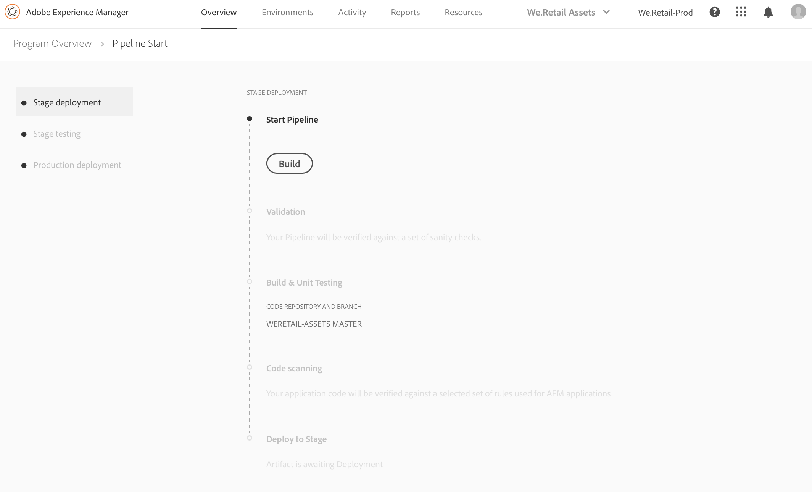

# Implantar o código {#deploy-your-code}

## Implantação do código com o Cloud Manager {#deploying-code-with-cloud-manager}

>[!NOTE]
>To learn about deploying code for Cloud Manager in AEM as a Cloud Service, see [here](https://experienceleague.adobe.com/docs/experience-manager-cloud-service/implementing/using-cloud-manager/deploy-code.html?lang=en#using-cloud-manager).

Depois de configurar o Pipeline de produção (repositório, ambiente e ambiente de teste), você estará pronto para implantar seu código.

1. Clique em **Implantar** no Cloud Manager para iniciar o processo de implantação.

   

1. O **Execução de pipeline** será exibida.

   Clique em **Criar** para iniciar o processo.

   

1. O processo de build completo implanta seu código.

   Os seguintes estágios estão envolvidos no processo de criação:

   1. Implantação do Estágio
   1. Teste de preparo
   1. Implantação de produção

   >[!NOTE]
   >
   >Além disso, você pode revisar as etapas de vários processos de implantação exibindo registros ou revisando resultados para os critérios de teste.

   A **Implantação do preparo** envolve estas etapas:

   * Validação: Essa etapa garante que o pipeline esteja configurado para usar os recursos disponíveis no momento, por exemplo, que a ramificação configurada exista, os ambientes estarão disponíveis.
   * Teste de compilação e unidade: Essa etapa executa um processo de criação contêiner. Consulte [Compreensão do ambiente de criação](/help/using/build-environment-details.md) para obter detalhes sobre o ambiente de criação.
   * Verificação de código: Esta etapa avalia a qualidade do código de seu aplicativo. Consulte [Entender os resultados de teste](understand-your-test-results.md) para obter detalhes sobre o processo de teste.
   * Implantar no Estágio

   

   The **Stage Testing**, involves the following steps:

   * Security Testing: This step evaluates the security impact of your application code on the AEM environment. Consulte [Entender os resultados de teste](understand-your-test-results.md) para obter detalhes sobre o processo de teste.
   * Teste de desempenho: Esta etapa avalia o desempenho do código do aplicativo. Consulte [Entender os resultados de teste](understand-your-test-results.md) para obter detalhes sobre o processo de teste.

   

   O **Implantação de produção** envolve as seguintes etapas:

   * **Application for Approval** (if enabled)
   * **Agendar implantação de produção** (se estiver habilitado)
   * **Suporte CSE** (se estiver habilitado)
   * **Implantar na produção**

   

   >[!NOTE]
   >
   >O **Agendar implantação de produção** está ativado ao configurar o pipeline.
   >
   >
   >Using this option, you can either schedule your production deployment or click **Now** to execute the production deployment immediately.
   >
   >
   >A data e a hora programadas são especificadas em termos de fuso horário do usuário.
   >
   >
   >Clique em **Confirmar** para verificar suas configurações.

   

   Depois de confirmar o agendamento da implantação, a implantação do código é concluída.

   A tela a seguir é exibida quando **Agora** é selecionada na etapa acima.

   

## Tempos limite {#timeouts}

The following steps will timeout if left waiting for user feedback:

| Etapa | Tempo limite |
|--- |--- |
| Teste de qualidade do código | 14 dias |
| Teste de segurança | 14 dias |
| Teste de desempenho | 14 dias |
| Pedido de aprovação | 14 dias |
| Schedule Production Deployment | 14 dias |
| CSE Support | 14 dias |

## Processo de implantação {#deployment-process}

A seção a seguir descreve como os pacotes de AEM e dispatcher são implantados na fase de estágio e na fase de produção.

Cloud Manager uploads all target/*.zip files produced by the build process to a storage location.  Esses artefatos são recuperados desse local durante as fases de implantação do pipeline.

Quando o Cloud Manager é implantado em topologias que não são de produção, o objetivo é concluir a implantação o mais rápido possível e, portanto, os artefatos são implantados em todos os nós simultaneamente da seguinte maneira:

1. O Cloud Manager determina se cada artefato é um pacote de AEM ou dispatcher.
1. O Cloud Manager remove todos os dispatchers do Balanceador de Carga para isolar o ambiente durante a implantação.

   A menos que configurado de outra forma, você pode ignorar as Alterações no Balanceador de Carga nas Implantações de Desenvolvimento e Estágio, ou seja, desanexar e anexar etapas em pipelines não de produção, para ambientes de desenvolvimento e o pipeline de produção, para ambientes de preparo.

   

   >[!NOTE]
   >
   >Espera-se que esse recurso seja usado principalmente por clientes 1-1-1.

1. Cada artefato de AEM é implantado em cada instância AEM por meio de APIs do Gerenciador de Pacotes, com dependências de pacote determinando a ordem de implantação.

   Para saber mais sobre como usar pacotes para instalar novas funcionalidades, transferir conteúdo entre instâncias e fazer backup do conteúdo do repositório, consulte Como trabalhar com pacotes.

   >[!NOTE]
   >
   >Todos os artefatos AEM são implantados tanto no autor quanto nos editores. Os run-modes devem ser usados quando configurações específicas a nós são necessárias. Para saber mais sobre como os run-modes permitem ajustar a instância de AEM para uma finalidade específica, consulte Modos de Execução.

1. O artefato do dispatcher é implantado em cada dispatcher da seguinte maneira:

   1. O backup das configurações atuais é feito e copiado para um local temporário
   1. Todas as configurações são excluídas, exceto os arquivos imutáveis. Consulte Gerenciar suas configurações do Dispatcher para obter mais detalhes. Isso limpa os diretórios para garantir que nenhum arquivo órfão seja deixado para trás.
   1. O artefato é extraído para o `httpd` diretório.  Arquivos imutáveis não são substituídos. Quaisquer alterações feitas em arquivos imutáveis no repositório Git serão ignoradas no momento da implantação.  Esses arquivos são fundamentais para a estrutura do AMS Dispatcher e não podem ser alterados.
   1. O Apache executa um teste de configuração. Se nenhum erro for encontrado, o serviço será recarregado. Se ocorrer um erro, as configurações serão restauradas a partir do backup, o serviço será recarregado e o erro será relatado ao Cloud Manager.
   1. Cada caminho especificado na configuração do pipeline é invalidado ou liberado do cache do dispatcher.

   >[!NOTE]
   >O Cloud Manager espera que o artefato do dispatcher contenha o conjunto completo de arquivos.  Todos os arquivos de configuração do dispatcher devem estar presentes no repositório Git. Arquivos ou pastas ausentes resultarão em falha na implantação.

1. Após a implantação bem-sucedida de todos os pacotes de AEM e dispatcher em todos os nós, os dispatchers serão adicionados novamente ao balanceador de carga e a implantação será concluída.

   >[!NOTE]
   >É possível ignorar as alterações do Balanceador de Carga nas implantações de desenvolvimento e estágio, ou seja, desanexar e anexar etapas em pipelines não relacionados à produção, para ambientes do desenvolvedor e no pipeline de produção, para ambientes de preparo.

### Implantação para fase de produção {#deployment-production-phase}

O processo de implantação das topologias de produção é um pouco diferente para minimizar o impacto para AEM visitantes do Site.

As implantações de produção geralmente seguem as mesmas etapas descritas acima, mas de maneira contínua:

1. Implantar pacotes de AEM para o autor.
1. Detach dispatcher1 from the load balancer.
1. Implante pacotes de AEM para publish1 e o pacote do dispatcher para dispatcher1 em paralelo, liberar o cache do dispatcher.
1. Coloque o dispatcher1 de volta no balanceador de carga.
1. Depois que o dispatcher1 estiver novamente em serviço, desconecte o dispatcher2 do balanceador de carga.
1. Implante AEM pacotes para publish2 e o pacote do dispatcher para o dispatcher2 em paralelo, liberar o cache do dispatcher.
1. Put dispatcher2 back into the load balancer.
This process continues until the deployment has reached all publishers and dispatchers in the topology.

## Modo de Execução do Pipeline de Emergência {#emergency-pipeline}

Em situações críticas, os clientes do Adobe Managed Services podem precisar implantar alterações de código em seus ambientes de preparo e produção sem esperar que um ciclo de teste completo do Cloud Manager seja executado.

Para lidar com essas situações, o pipeline de produção do Cloud Manager pode ser executado em um *emergência* modo. Quando este modo é utilizado, as etapas dos testes de segurança e desempenho não são executadas; todas as outras etapas, incluindo qualquer etapa de aprovação configurada, são executadas como no modo de execução normal do pipeline.

>[!NOTE]
>Emergency Pipeline Execution Mode capability is activated on a program basis by the Customer Success Engineers.

### Using Emergency Pipeline Execution Mode {#using-emergency-pipeline}

Ao iniciar a execução de um pipeline de produção, se esse recurso tiver sido ativado, é possível iniciar a execução no modo normal ou de emergência na caixa de diálogo, conforme mostrado na figura abaixo.


Additionally, viewing the pipeline execution details page for an execution run in emergency mode, the breadcrumbs at the top of the screen shows an indicator that emergency mode was used for this particular execution.


Creating a pipeline execution in this emergency mode can also be done through the Cloud Manager API or CLI. To start an execution in Emergency Mode, submit a PUT request to the pipeline&#39;s execution endpoint with the query parameter `?pipelineExecutionMode=EMERGENCY` or, when using the CLI:

```
$ aio cloudmanager:pipeline:create-execution PIPELINE_ID --emergency
```

>[!IMPORTANT]
>Usando `--emergency` O sinalizador pode exigir atualização para o mais recente `aio-cli-plugin-cloudmanager` versão.

## Reexecutar uma implantação de produção {#Reexecute-Deployment}

Re-execution of the production deployment step is supported for executions where the production deploy step has completed. O tipo de conclusão não é importante - a implantação pode ser bem-sucedida (somente para programas AMS), cancelada ou malsucedida. That said, the primary use case is expected to be cases where the production deployment step failed for transient reasons. A reexecução cria uma nova execução usando o mesmo pipeline. Essa nova execução consiste em três etapas:

1. The validate step – this is essentially the same validation that occurs during a normal pipeline execution.
1. The build step – in the context of a re-execution, the build step is copying artifacts, not actually executing a new build process.
1. A etapa de implantação de produção - usa a mesma configuração e as mesmas opções da etapa de implantação de produção em uma execução normal de pipeline.

A etapa de build pode ser rotulada de forma um pouco diferente na interface do usuário para refletir que está copiando artefatos, não reconstruindo.


Limitações:

* A reexecução da etapa de implantação de produção só estará disponível na última execução.
* A reexecução não está disponível para execuções de reversão.
* If the last execution is a rollback execution, re-execution is not possible.
* Se a última execução for uma execução de atualização por push, a reexecução não será possível.
* Se a última execução falhar em qualquer ponto antes da etapa de implantação de produção, a reexecução não será possível.

### Reexecutar a API {#Reexecute-API}

### Identificação de uma execução de nova execução

Para identificar se uma execução é uma execução reexecutada, o campo trigger pode ser examinado. Its value will be *RE_EXECUTE*.

### Triggering a new execution

Para acionar uma reexecução, uma solicitação de PUT precisa ser feita ao HAL Link &lt;(<http://ns.adobe.com/adobecloud/rel/pipeline/reExecute>)> no estado da etapa de implantação de produção. If this link is present, the execution can be restarted from that step. If it is absent, the execution cannot be restarted from that step. Na versão inicial, esse link só estará presente na etapa de implantação de produção, mas versões futuras poderão oferecer suporte para iniciar o pipeline a partir de outras etapas. Exemplo:

```Javascript
 {
  "_links": {
    "http://ns.adobe.com/adobecloud/rel/pipeline/logs": {
      "href": "/api/program/4/pipeline/1/execution/953671/phase/1575676/step/2983530/logs",
      "templated": false
    },
    "http://ns.adobe.com/adobecloud/rel/pipeline/reExecute": {
      "href": "/api/program/4/pipeline/1/execution?stepId=2983530",
      "templated": false
    },
    "http://ns.adobe.com/adobecloud/rel/pipeline/metrics": {
      "href": "/api/program/4/pipeline/1/execution/953671/phase/1575676/step/2983530/metrics",
      "templated": false
    },
    "self": {
      "href": "/api/program/4/pipeline/1/execution/953671/phase/1575676/step/2983530",
      "templated": false
    }
  },
  "id": "6187842",
  "stepId": "2983530",
  "phaseId": "1575676",
  "action": "deploy",
  "environment": "weretail-global-b75-prod",
  "environmentType": "prod",
  "environmentId": "59254",
  "startedAt": "2022-01-20T14:47:41.247+0000",
  "finishedAt": "2022-01-20T15:06:19.885+0000",
  "updatedAt": "2022-01-20T15:06:20.803+0000",
  "details": {
  },
  "status": "FINISHED"
```


A sintaxe do link HAL *href*  O valor acima não se destina a ser usado como ponto de referência. O valor real deve sempre ser lido do link HAL e não gerado.

Envio de um *PUT* a solicitação para esse endpoint resultará em uma *201º* se bem-sucedido e o corpo da resposta será a representação da nova execução. É semelhante a iniciar uma execução regular por meio da API.
