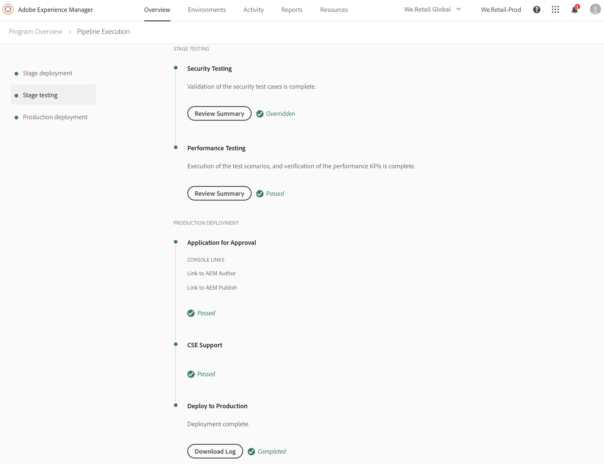

# Implantar seu código {#deploy-your-code}

## Implantação de código com o Gerenciador de nuvem {#deploying-code-with-cloud-manager}

Depois de configurar **o Pipeline** (repositório, ambiente e ambiente de teste), você estará pronto para implantar seu código.

1. Clique **em Implantar** no Gerenciador da nuvem para iniciar o processo de implantação.

   

1. A **tela Execução** de pipeline é exibida.

   Clique **em Criar** para iniciar o processo.

   

1. O processo de criação completo implanta seu código.

   Os seguintes estágios estão envolvidos no processo de compilação:

   1. Implantação do palco
   1. Teste do palco
   1. Implantação de produção
   >[!NOTE]
   >
   >Além disso, você pode rever as etapas de vários processos de implantação exibindo registros ou revisando resultados para os critérios de teste.

   A implantação **** do palco envolve as seguintes etapas:

   * Teste e unidade de teste
   * Digitalização de código
   * Implantar no palco
   

   O Teste **** do palco envolve as seguintes etapas:

   * Teste de segurança
   * Teste de desempenho
   

   A implantação **** de produção envolve as seguintes etapas:

   * **Aplicativo para aprovação** (se ativado)
   * **Programar implantação de produção** (se ativado)
   * **Suporte CSE** (se ativado)
   * **Implantar na produção**
   >[!NOTE]
   >
   >A **Programação de produção agendada** está ativada durante a configuração do pipeline.
   >
   >
   >Com essa opção, você pode programar o seu dourado de produção ou clicar **em Agora** para executar a implantação de produção imediatamente.
   >
   >
   >A data e hora programadas são especificadas em termos do fuso horário do usuário.
   >
   >
   >Clique **em Confirmar** para verificar suas configurações.

   

   Após confirmar o agendamento de implantação, a implantação do código é concluída.

   A tela a seguir é exibida, quando **a** opção Agora está selecionada na etapa acima.

   

## Processo de implantação {#deployment-process}

A seção a seguir descreve como os pacotes do AEM e do expedidor são implantados na fase do estágio e na fase de produção.

O Cloud Manager carrega todos os arquivos target/*.zip produzidos pelo processo de criação para um local de armazenamento. Esses artefatos são recuperados desse local durante as fases de implantação do pipeline.

Quando o Experience Cloud Manager implanta em topologias de não produção, o objetivo é concluir a implantação o mais rápido possível e, portanto, os artefatos são implantados em todos os nós simultaneamente da seguinte maneira:

1. O Gerenciador de nuvem determina se cada artefato é um pacote AEM ou expedidor.
1. O Cloud Manager remove todos os dispatchers do Balanceador de carga para isolar o ambiente durante a implantação.
1. Cada artefato AEM é implantado em cada instância AEM por meio de apis do Gerenciador de pacotes, com dependências de pacote que determinam a ordem de implantação.

   Para saber mais sobre como usar os pacotes para instalar uma nova funcionalidade, transferir conteúdo entre instâncias e fazer backup do conteúdo repositório, consulte Como trabalhar com pacotes.

   >[!NOTE]
   >
   >Todos os artefatos AEM são implantados tanto no autor como nos editores. Os modos de execução devem ser aproveitados quando configurações específicas de nó são necessárias. Para saber mais sobre como os modos de execução permitem ajustar sua instância do AEM para uma finalidade específica, consulte Executar modos.

1. O artefato do expedidor é implantado em cada dispatcher da seguinte maneira:

   1. As configurações atuais são armazenadas e copiadas em um local temporário
   1. Todas as configurações são excluídas, exceto os arquivos imutáveis. Consulte Gerenciar suas Configurações do Dispatcher para obter mais detalhes. Isso limpa os diretórios para garantir que nenhum arquivo órfão seja deixado em espera.
   1. O artefato é extraído para o diretório httpd. Arquivos imaláveis não são substituídos. Todas as alterações feitas em arquivos imutáveis no seu repositório de git serão ignoradas no momento da implantação. Esses arquivos são essenciais para a estrutura do dispatcher AMS e não podem ser alterados.
   1. O Apache realiza um teste de configuração. Se nenhum erro for encontrado, o serviço será recarregado. Se ocorrer um erro, as configurações serão restauradas de backup, o serviço será recarregado e o erro será relatado de volta para o Experience Cloud Manager.
   1. Cada caminho especificado na configuração do pipeline é invalidado ou liberado do cache do expedidor.
   >[!NOTE]
   >
   >O Gerenciador de nuvem espera que o artefato do expedidor contenha o conjunto completo de arquivos. Todos os arquivos de configuração do expedidor devem estar presentes no repositório do git. Arquivos ou pastas ausentes resultarão na falha de implantação.

1. Após a implantação bem-sucedida de todos os pacotes do AEM e do dispatcher para todos os nós, os dispatchers são adicionados ao balanceador de carga e a implantação é concluída.

### Implantação para fase de produção {#deployment-production-phase}

O processo de implantação em topologias de produção difere ligeiramente para minimizar o impacto nos visitantes do AEM Site.

As implantações de produção geralmente seguem as mesmas etapas acima, mas de forma contínua:

1. Implante pacotes do AEM para autor.
1. Desconecte o dispatcher 1 do balanceador de carga.
1. Implante pacotes do AEM para publicar 1 e o pacote do dispatcher no dispatcher 1, esvaziar o cache do dispatcher.
1. Coloque o dispatcher 1 de volta no balanceador de carga.
1. Depois que o dispatcher 1 voltar ao serviço, desconecte o dispatcher 2 do balanceador de carga.
1. Implante pacotes do AEM para publicar 2 e o pacote do dispatcher no dispatcher 2, esvaziar o cache do dispatcher.
1. Coloque o dispatcher 2 de volta no balanceador de carga.
Esse processo continua até que a implantação atinja todos os editores e os dispatchers na topologia.

