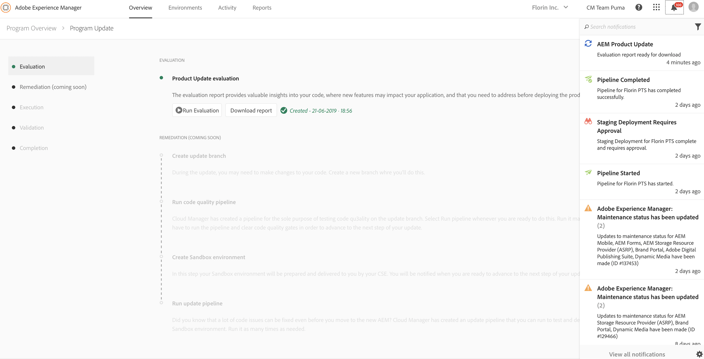

# Evaluation Phase {#evaluation}

Once you click **[!UICONTROL Start Update]**, the first phase in Product Update wizard is the **[!UICONTROL Evaluation]** phase. Nessa fase, você pode avaliar a complexidade da atualização com o padrão detectado diretamente para você do assistente. No final desta etapa, você terá acesso ao relatório de avaliação.

O relatório gerado permite verificar a instância do Autor para atualizá-la, detectando padrões que:

* Violar determinadas regras e são feitas em áreas que serão afetadas ou substituídas pela atualização.

* Use um recurso AEM 6. x ou uma API que não seja compatível com o novo AEM e que possa ser break após a atualização.

Isso serve como uma avaliação do esforço de desenvolvimento envolvido na atualização para o Adobe Experience Manager (AEM) 6.5.

>[!NOTE]
>To learn more about pattern detector, refer to [Assessing the Upgrade Complexity with the Pattern Detector](https://helpx.adobe.com/experience-manager/6-4/sites/deploying/using/pattern-detector.html)

## Running the Evaluator {#running-evaluator}

Siga as etapas abaixo para executar o avaliador:

1. Click on **[!UICONTROL Run Evaluation]** to run the pattern detector.

   >[!NOTE]
   >O detector padrão pode ser executado em qualquer ambiente. No entanto, para aumentar a taxa de detecção e evitar qualquer lentidão em casos críticos de negócios, o Cloud Manager executará o procedimento no ambiente de preparo temporário na instância do autor.

   

1. O assistente informa o status da sua ação. You will notice **In progress** or **completed** as applicable when the evaluation report is being generated.

   Once the report is generated, you can click on **[!UICONTROL Download report]** to save a copy of the evaluation report.

   

   Cumulativo, você pode exibir as notificações de pulso atualizadas, como atualizações de status.

   

>[!NOTE]
>The other four phases succeeding **Evaluation** namely **Remediation**, **Execution**, **Validation**, and **Completion** are coming soon and are not available in the current release.
