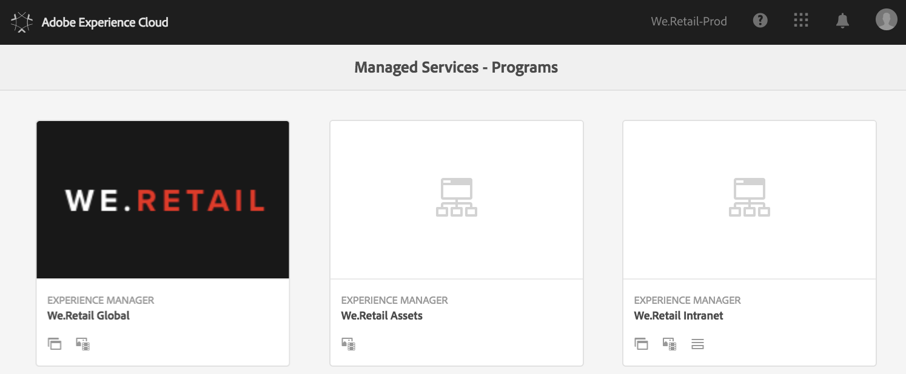

# Primeiro logon {#first-time-login}

Depois de configurar as configurações gerais para [!UICONTROL Cloud Manager], você estará pronto para usar a interface do usuário para [!UICONTROL Cloud Manager].

>[!NOTE]
>
>Dependendo das funções atribuídas em [!UICONTROL Cloud Manager] e do estado do aplicativo, você verá telas diferentes ao usar a [!UICONTROL Cloud Manager] interface do usuário.

## Tutorial em vídeo {#video-tutorial-one}

### Programas do Cloud Manager {#programs-video}

O vídeo a seguir fornece uma visão geral dos Programas do Cloud Manager que representam conjuntos de ambientes AEM que suportam conjuntos lógicos de iniciativas de negócios, normalmente correspondentes a um SLA (Service Level Agreement, contrato de nível de serviço) adquirido.

>[!VIDEO](https://video.tv.adobe.com/v/26313/?captions=por_br)

## Logon pela primeira vez {#logging-in-for-the-first-time}

1. Faça logon na **Adobe[!UICONTROL Experience Cloud]** e você verá a lista de **Programas**.

   

1. Selecione o programa (por exemplo, **We.Retail Global**) e clique no ícone superior esquerdo para abrir [!UICONTROL Cloud Manager].

   

1. O painel para [!UICONTROL Cloud Manager] é exibido.

   

1. Clique em **Configurar programa** para definir a descrição do **programa** e definir os Indicadores-chave de desempenho (KPIs).

   >[!NOTE]
   >
   >Consulte [Configurar seu programa](https://helpx.adobe.com/experience-manager/cloud-manager/using/setting-up-program.html) para concluir as próximas etapas.

## Tutorial em vídeo {#video-tutorial-two}

### Guia Atividade do Cloud Manager {#activity-video}

O Cloud Manager fornece uma visão consolidada da atividade de um Programa, relacionando todas as execuções de Pipeline CI/CD, tanto a produção quanto a não produção, permitindo a visibilidade da atividade atual e passada, e os Detalhes de qualquer atividade podem ser revisados.

>[!VIDEO](https://video.tv.adobe.com/v/26313/?captions=por_br)