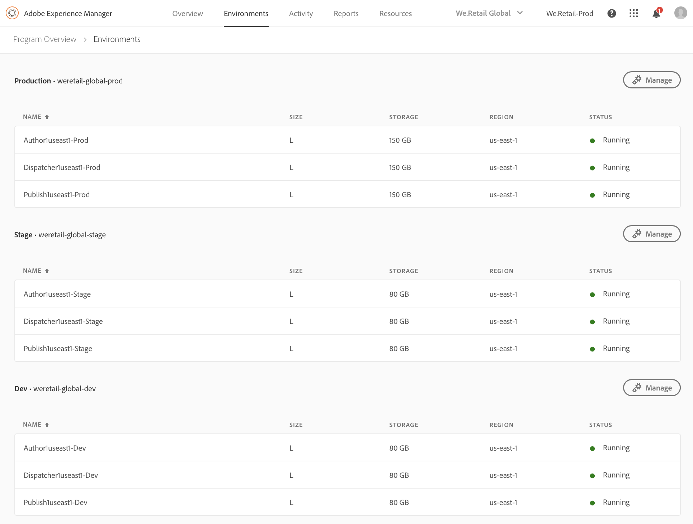

# Gerenciar seus ambientes {#manage-your-environments}

A página **Visão geral** do Gerenciador de nuvem inclui o bloco **de Ambientes** que lista todos os ambientes AEM gerenciados.

Cada um dos ambientes listados exibe seu status associado.

## Acessar ambientes no Gerenciador de nuvem {#accessing-environments-in-cloud-manager}

O bloco **Ambientes** exibe os ambientes de Produção e Stage fornecidos no seu programa junto com o status.

O status é o estado de potência integrada entre os nós no ambiente. É verde se todos os nós estiverem sendo executados, vermelho se até mesmo um nó for interrompido, azul se até um nó estiver chegando e amarelo se até um nó tiver um estado de potência indisponível (nesta ordem de prioridade).

### Ambientes {#environments}

Clique **em Gerenciar** para exibir a **tela Ambientes** .

A tela **Ambientes** exibe um cartão para os ambientes *Production* e *Stage* (se for o caso) no seu programa. O nome do ambiente é visualizado acima de cada cartão. O cartão inclui uma tabela de nós no ambiente junto com o tamanho t-camt da cpu, o armazenamento, a região e o status.

>[!NOTE]
>
>O **STATUS** do nó representa o estado de potência da VM e não reflete o status do AEM no servidor. O status pode estar **em Execução** (círculo verde), **Interrompido** (círculo vermelho), **Vindo** (círculo azul) ou **Indisponível** (círculo amarelo).

