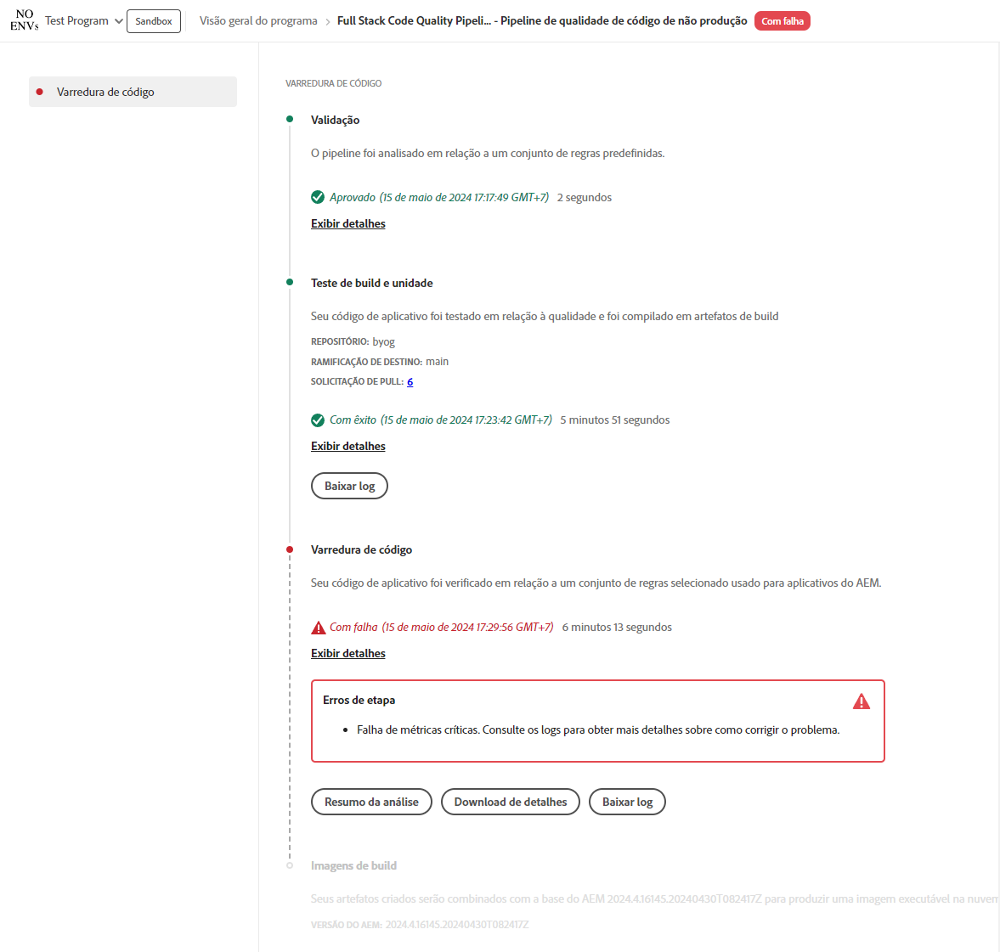

# Gerenciar pipelines {#managing-pipelines}

Saiba como gerenciar os pipelines, incluindo sua execução, edição e exclusão.

## Cartão do pipeline {#pipeline-card}

O cartão **Pipelines** na página **Visão geral do programa** no Cloud Manager fornece uma visão geral de todos os seus pipelines e seu status atual.

Ao clicar no ícone  ao lado de cada pipeline, você pode realizar as seguintes ações:

* [Executar o pipeline](#running-pipelines).
* [Editar o pipeline](#editing-pipelines).
* [Excluir o pipeline](#deleting-pipelines).
* [Exibir detalhes](#view-details).

Na parte inferior da lista de pipelines, você tem as seguintes opções gerais.

* **Adicionar**: para [adicionar um novo pipeline de produção](/help/using/production-pipelines.md) ou [adicionar novo pipeline de não produção](/help/using/non-production-pipelines.md).
* **Exibir todos**: leva o usuário para a tela **Pipelines** para exibir todos os pipelines em uma tabela mais detalhada
* **Acessar informações do repositório**: Exibe as informações necessárias para acessar o repositório Git do Cloud Manager.
* **Saiba mais**: Navega até os recursos de documentação do pipeline de CI/CD.

## Página Pipelines {#pipelines}

A página **Pipelines** mostra uma lista completa de todos os pipelines do programa selecionado. Esta lista é útil porque apresenta informações mais abrangentes que as disponíveis no [cartão do pipeline](#pipeline-card).

1. Faça logon no Cloud Manager em [my.cloudmanager.adobe.com](https://my.cloudmanager.adobe.com/) e selecione a organização e o programa apropriados.

1. Na página **Visão geral do programa**, clique na guia **Pipelines** para alternar para a página **Pipelines**.

1. Nessa janela você pode ver uma lista de todos os pipelines do programa, bem como iniciar e parar a execução do pipeline, assim como no **cartão do pipeline**.

Clicar no ícone `i` revela detalhes sobre a última execução ou a execução atual do pipeline.

Clicar em **Exibir detalhes** mostrará os [detalhes da execução do pipeline](#view-details).

### Marcar favoritos do pipeline{#pipeline-favorites}

Você pode marcar pipelines específicos como favoritos para que eles apareçam no topo da lista na página **Pipelines**. Essa capacidade facilita a localização e a execução de pipelines acessados com frequência.

**Para marcar os favoritos do pipeline:**

1. Faça logon no Cloud Manager em [my.cloudmanager.adobe.com](https://my.cloudmanager.adobe.com/) e selecione a organização e o programa apropriados.
1. Na página **Visão geral do programa**, clique na guia  **Pipelines**.
1. Na página **Pipelines**, à esquerda do nome e do tipo do pipeline, clique em  para adicioná-lo à lista de favoritos.
Como alternativa, clique em  para remover o pipeline da sua lista de favoritos.

## Página Atividade {#activity}

A página **Atividades** mostra uma lista completa de todas as execuções de pipelines do programa selecionado.

1. Faça logon no Cloud Manager em [my.cloudmanager.adobe.com](https://my.cloudmanager.adobe.com/) e selecione a organização e o programa apropriados.

1. Na página **Visão geral do programa**, clique na guia **Atividade** para alternar para a página **Atividade**.

1. Aqui você pode ver uma lista de todas as execuções de pipeline do programa, incluindo as execuções atuais e históricas.

Clicar no ícone `i` revela detalhes sobre a execução do pipeline selecionado.

Clique em **Exibir detalhes** para revisar os [detalhes da execução do pipeline](#view-details).

## Executar um pipeline {#run-one-pipeline}

1. Faça logon no Cloud Manager em [my.cloudmanager.adobe.com](https://my.cloudmanager.adobe.com/) e selecione a organização e o programa apropriados.
1. Navegue até o cartão **Pipelines** na página **Visão geral do programa**.
1. Clique em  ao lado do pipeline que você está executando e em **Executar**.

   A coluna Status indica quando a execução do pipeline começa.

   Você pode ver os detalhes da execução clicando no ícone  novamente e clicando em **[Exibir detalhes](#view-details)**.

   Dependendo do tipo de pipeline, talvez seja possível cancelar a execução clicando em  novamente e clicando em **Cancelar**.

## Executar vários pipelines {#run-multiple-pipelines}

Com o Cloud Manager, é possível executar vários pipelines simultaneamente, melhorando a eficiência da implantação para clientes do Adobe Managed Services (AMS). O recurso **Executar selecionados** permite selecionar vários pipelines e acioná-los para execução simultânea. Ele reduz o esforço manual de execução de pipelines individualmente e otimiza os fluxos de trabalho de criação e implantação.

**Para executar vários pipelines:**

1. Faça logon no Cloud Manager em [my.cloudmanager.adobe.com](https://my.cloudmanager.adobe.com/) e selecione a organização e o programa apropriados.
1. No menu do lado esquerdo, clique em  **Pipelines**.
1. Na tabela na página **Pipeline**, marque as caixas de seleção ao lado dos pipelines que deseja executar.
Se necessário, clique em  **Filtros** para classificar pipelines por nome, ambiente ou tipo de código implantado, ou uma combinação dos três.
1. Ao lado do canto superior direito da página, clique em **Executar selecionados (x)**.
1. Na caixa de diálogo **Executar pipelines selecionados (x)**, clique em **Executar (x)**.

   O botão **Executar** reflete o número de pipelines que podem continuar. Por exemplo, você pode ter selecionado quatro pipelines, mas um já está em execução. Ou um ambiente vinculado a um pipeline selecionado não existe mais. Nesses casos, o sistema se ajusta de acordo. O botão é atualizado para &quot;Executar (3)&quot; para indicar que três pipelines podem continuar.

1. Os pipelines começam a ser executados e seu status é atualizado na lista **Pipelines**.

## Editar pipelines {#editing-pipelines}

Não é possível editar um pipeline que está em execução.

**Para editar pipelines:**

1. Faça logon no Cloud Manager em [my.cloudmanager.adobe.com](https://my.cloudmanager.adobe.com/) e selecione a organização e o programa apropriados.

1. Na página **Visão geral do programa**, navegue até o cartão **Pipelines**.

1. Clique em  ao lado do pipeline que você deseja editar e clique em **Editar**.

1. Na caixa de diálogo **Editar Pipeline de Produção** ou **Editar Pipeline de Não Produção**, você pode editar os mesmos detalhes inseridos durante a criação do pipeline.

   Consulte [Configuração de pipelines de produção](/help/using/production-pipelines.md) e [Configuração de pipelines de não produção](/help/using/non-production-pipelines.md) para obter detalhes sobre os campos e as opções de configuração disponíveis para pipelines.

1. Quando terminar, clique em **Atualizar**.

## Excluir pipelines {#deleting-pipelines}

Não é possível excluir um pipeline em execução.

**Para excluir pipelines:**

1. Faça logon no Cloud Manager em [my.cloudmanager.adobe.com](https://my.cloudmanager.adobe.com/) e selecione a organização e o programa apropriados.

1. Na página **Visão geral do programa**, navegue até o cartão **Pipelines**.

1. Clique em  ao lado do pipeline que você está executando e em **Excluir**.

## Exibir detalhes do pipeline {#view-details}

Só é possível exibir detalhes de um pipeline que está em execução ou que foi executado pelo menos uma vez.

**Para exibir detalhes do pipeline:**

1. Faça logon no Cloud Manager em [my.cloudmanager.adobe.com](https://my.cloudmanager.adobe.com/) e selecione a organização e o programa apropriados.

1. Na página **Visão geral do programa**, navegue até o cartão **Pipelines**.

1. Clique em  ao lado do pipeline que você está executando e em **Exibir detalhes**.

1. Você será levado à página de detalhes do pipeline em execução.

Aqui, você pode ver o status das várias etapas do pipeline e recuperar logs de build para fins de diagnóstico. Consulte o documento [Implantação do código](/help/using/code-deployment.md) para obter mais informações.

Ao exibir todas as etapas de uma execução de pipeline, as que ainda não foram iniciadas aparecem esmaecidas. As etapas concluídas exibem sua duração.

Quando uma etapa do pipeline é concluída, um resumo é apresentado.

Clique no link **Exibir detalhes** para revelar a seção **Duração**. Esta seção inclui a duração média do pipeline com base na tendência histórica para esse programa.

Se seu pipeline continha uma etapa de **Verificação de código**, o que gerou problemas, você pode clicar em **Detalhes do download** para exibir uma lista de [testes de qualidade do código](/help/using/code-quality-testing.md) que não foram aprovados.

Uma coluna **Localização do arquivo do projeto** está disponível no arquivo CSV para indicar a localização do código incorreto. Essa coluna é o caminho relativo do projeto, enquanto a coluna **Localização do arquivo** é gerada pelo Maven.

