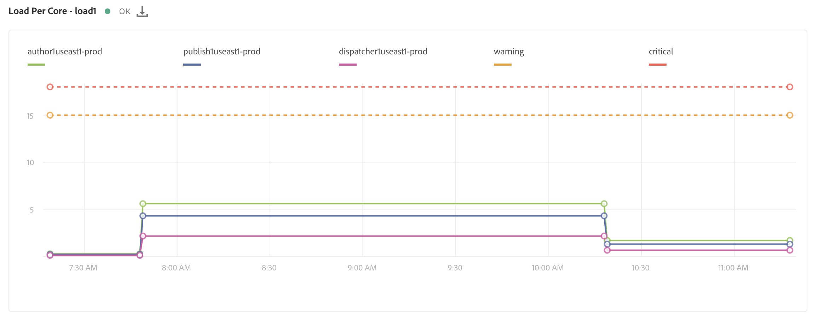

# Monitoramento do sistema {#system-monitoring}

O monitoramento do sistema em [!UICONTROL Cloud Manager] é feito observando as instâncias individuais em um ambiente e rastreando várias métricas para cada instância. Cada métrica tem dois limites definidos - um limite *de* aviso e um limite ** crítico.

Se uma métrica ultrapassar o seu limite crítico, considera-se que se encontra num estado crítico; se uma métrica estiver acima de seu limite de aviso (mas abaixo de seu limite crítico), ela será considerada como estando em um estado de aviso. Os limites são definidos pelo Adobe Managed Services e podem ser visualizados em [!UICONTROL Cloud Manager]. Na maioria dos casos, os limites são consistentes entre os clientes, mas há casos em que o Adobe Managed Services modificará os limites para atender às necessidades específicas do cliente. As perguntas sobre os limites devem ser direcionadas ao engenheiro de sucesso do cliente (CSE).

## Navegação até o monitoramento do sistema {#navigating-system-monitoring}

Navegar até o recurso Monitoramento do sistema pode ser feito de duas formas.

1. Faça logon nos Serviços **gerenciados - landing page de Programas** .

   

1. Clique no quarto ícone no cartão do programa.

   

   *Ou*,

* Navegue até a landing page Monitoramento **do** Sistema pelo item de menu de navegação global **Relatórios** dentro [!UICONTROL Cloud Manager].

## Página Visão geral do monitoramento do sistema {#system-monitoring-overview-page}

A página Visão geral de monitoramento do sistema lista os ambientes monitorados no programa e relata sobre sua integridade de alto nível em quatro categorias separadas:

* **Host**
* **Armazenamento**
* **Rede**
* **Aplicativo**

O status em cada categoria é um resumo de métricas individuais - se qualquer métrica em uma categoria estiver no estado crítico, toda a categoria estará em um estado crítico para a finalidade da página de visão geral. O mesmo resumo pode ser visualizado em nível de ambiente e de instância.

>[!NOTE]
>
>Por padrão, ao navegar até essa página, as instâncias do ambiente de produção ficam visíveis, mas outros ambientes também podem ser abertos.

## Tutorial em vídeo {#video-tutorial}

### Visão geral dos relatórios do Cloud Manager {#reports-video}

Os Relatórios do Gerenciador de nuvem fornecem uma visualização aos Ambientes do Programa e às instâncias do AEM por meio de um conjunto de gráficos que relatam e rastreiam várias métricas para cada instância do AEM.
Consulte o vídeo abaixo para obter mais detalhes.

>[!VIDEO](https://video.tv.adobe.com/v/26315/)

## Detalhes do monitoramento do sistema {#system-monitoring-detail}

Para visualização dos detalhes de métricas específicas, você pode clicar em uma das categorias no painel de navegação esquerdo ou clicar em um dos indicadores de categoria de uma instância específica. Cada página de detalhes mostra uma série de gráficos para as métricas dentro dessa categoria. Você pode visualização as métricas para todas as instâncias em um ambiente ou para uma instância específica. Você pode alternar entre o ambiente e as instâncias usando as caixas suspensas no canto superior direito.

A navegação à esquerda mostrará as métricas disponíveis na categoria atualmente selecionada para as quais há dados para o ambiente e as instâncias atualmente selecionadas.

Um gráfico individual mostrará o status e um gráfico dos dados ao longo do tempo, juntamente com os limites. Se várias instâncias forem exibidas, os dados de cada instância estarão em uma série separada.

Uma série individual pode ser ocultada em um gráfico ao clicar na série na legenda.
Por exemplo, se você clicar na série de limites de aviso, verá apenas o limite crítico.

### Definições de métrica {#metric-definitions}

**Host**

* Carregar por núcleo: o número de processos que estão sendo executados pela CPU ou que estão em um estado de espera, em média, em um período de um (load1), cinco (load5) e quinze (load15) minutos.
* Contagem de processos: o número de processos atualmente abertos.
* Contagem de usuários: o número de usuários com uma sessão de shell ativa.
* Uso de memória: a porcentagem da memória do sistema alocada no momento.
* Memória JVM (heap): o tamanho (em Megabytes) do Java Heap alocado.
* Espaço de geração antiga: a porcentagem da memória JVM Old Generation alocada no momento.

**Rede**

* Verificação da porta CQ: O tempo de resposta em segundos para acessar a porta do AEM ou Dispatcher. Há métricas diferentes para autor, publicação e despachante.

**Armazenamento**

* Espaço em disco: O espaço em disco usado (em Megabytes) para cada ponto de montagem no host. Há métricas diferentes para cada ponto de montagem. No mínimo, você verá métricas para &quot;/&quot; e &quot;/mnt&quot;, mas métricas adicionais de ponto de montagem podem estar disponíveis dependendo da configuração específica da instância.
* Tamanho da pasta: Armazenamento de segmentos do AEM: O espaço em disco usado (em Gigabytes) para o AEM Segment Store.

**Aplicativo**

* Agente de Replicação: O tempo, em segundos, para um evento de replicação de teste. Há métricas separadas para cada agente de replicação.
* Liberação do Dispatcher: O número de itens atualmente na fila de despachantes.

## Relatórios SLA {#sla-reporting}

Os clientes podem ver o desempenho de seu ambiente AEM de produção em relação ao SLA (Service Level Agreement, contrato de nível de serviço). Isso está disponível por meio de um submenu na tela Relatórios.
Por exemplo, o gráfico abaixo mostra o nível de SLA mensal para 2018.

Assim como nos gráficos de monitoramento do sistema, rolar sobre um ponto de dados mostra os valores específicos para esse mês.

A seção Análise do Evento neste gráfico mostra o conjunto de incidentes que ocorreram no programa durante o ano selecionado. Cada incidente tem um intervalo de tempo, uma causa e um conjunto de comentários.

## Métricas de SLA {#sla-metrics}

* **Contrato** do autor: Este é o SLA definido em seu contrato com os Serviços gerenciados da Adobe para a camada do autor.

* **SLA** do autor do AMS: Esse é o tempo de atividade medido dos incidentes de factoring de nível do autor da produção causados pela Adobe ou por nossos fornecedores.

* **SLA** do autor: Esse é o tempo de atividade medido da camada do autor ignorando o tempo de inatividade programado, como janelas de manutenção.

* **Contrato** do usuário final: Este é o SLA definido em seu contrato com os Serviços gerenciados da Adobe para a camada de publicação.

* **SLA** do usuário final do AMS: Esse é o tempo de atividade medido dos incidentes de factoring de nível de publicação de produção causados pela Adobe ou por nossos fornecedores.

* **SLA** do usuário final: Esse é o tempo de atividade medido da camada de publicação ignorando o tempo de inatividade programado, como janelas de manutenção.