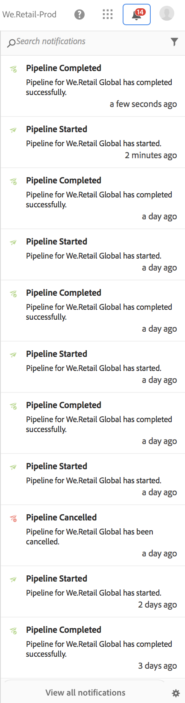
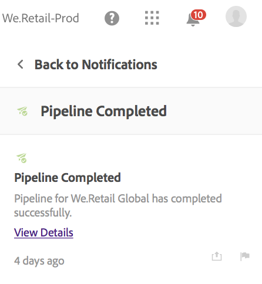

# Notificações {#notifications}

[!UICONTROL Cloud Manager] permite que o usuário receba notificações quando um Pipeline é iniciado e concluído (com êxito ou sem êxito), no início de uma implantação de produção, bem como quando as etapas Aprovação **** em tempo real e **Agendada** são atingidas. Essas notificações são enviadas pelo sistema de notificação da Adobe [!UICONTROL Experience Cloud] .

>[!NOTE]
>
>As notificações de aprovação e programadas são enviadas somente para usuários nas funções Proprietário da empresa, Gerente de programa e Gerenciador de implantação.

As notificações são exibidas em uma barra lateral na [!UICONTROL Cloud Manager] interface do usuário e em toda a Adobe [!UICONTROL Experience Cloud].

Clique no ícone de sino no cabeçalho para abrir a barra lateral e exibir as notificações, como mostrado na figura abaixo:

A barra lateral lista as notificações mais recentes.

Além disso, clique em uma dessas notificações e, em seguida, clique em **Exibir detalhes** para acessar a página Detalhes de execução do Pipeline.

## Notificações por email {#email-notifications}

Por padrão, as notificações estão disponíveis na interface do usuário da Web nas [!UICONTROL Experience Cloud] soluções da Adobe. Os usuários individuais também podem optar por essas notificações serem enviadas por email, imediatamente ou por compilação.

Clique no ícone de engrenagem na parte inferior da barra lateral das notificações, conforme mostrado na figura abaixo:

Isso levará o usuário para a tela Preferências de notificações na Adobe [!UICONTROL Experience Cloud].

Os usuários podem ativar as notificações por email e (opcionalmente) selecionar os tipos de notificações que desejam receber por email.

>[!NOTE]
>
>Você também pode ativar a compilação da Adobe [!UICONTROL Experience Cloud], como mostrado abaixo:

