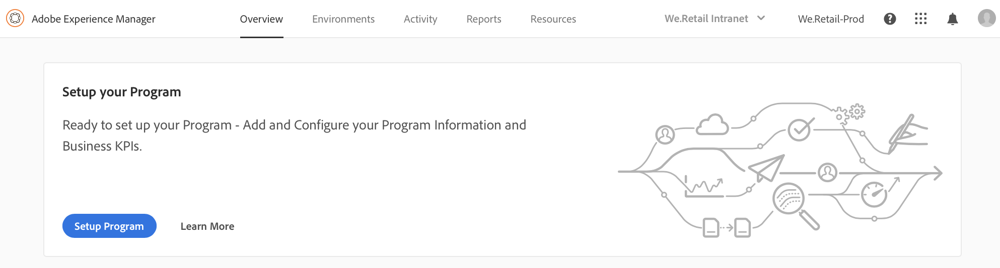

# Configuração do programa {#setup-your-program}

Após a contratação, o proprietário do negócio precisará concluir uma configuração inicial do programa. Isso envolve definir a descrição do programa e definir os Indicadores-chave de desempenho (kpis) que serão usados para testes de desempenho. Opcionalmente, uma miniatura pode ser carregada. Além disso, o proprietário do negócio pode configurar os ambientes de provisionamento ao configurar o programa.

Os kpis definidas servem como uma linha de base para testes de desempenho passados cada vez que o pipeline é executado.

>[!NOTE]
>
>Os kpis definidos são medidos nos testes executados no ambiente **stage** . Normalmente, esses kpis são reduzidos para se ajustar aos recursos do ambiente stage.
>
>Por exemplo, um usuário esperando uma média de 1000 exibições de página por minuto no **ambiente de produção** e com quatro servidores de dispatcher/publish na produção deve dimensionar isso para 250 visualizações de página por minuto (assumindo que o ambiente do palco consiste em apenas um único par do servidor de publicação/publicação).
>
>Além disso, muitos usuários terão uma Rede de entrega de conteúdo (CDN), como Akamai ou cloudfront na frente do ambiente de produção. Como [!UICONTROL Cloud Manager] os testes com relação ao ambiente do palco diretamente, o KPI deve refletir somente o tráfego esperado para passar pelo CDN, ou seja, erros de cache. Geralmente, isso será um subconjunto relativamente pequeno do tráfego total de produção.

## Uso [!UICONTROL Cloud Manager] para Configurar seu Programa {#using-cloud-manager-to-setup-your-program}

Siga as etapas abaixo para configurar o programa e definir kpis:

1. Clique em **Configuração Programa** para iniciar [!UICONTROL Cloud Manager]o processo de configuração.

   

1. A tela **de Configuração do programa** exibe as Informações do programa Editar.

1. Você verá três opções como **guia Geral**, **KPI** e **Provisionamento** .

1. Em **Geral** , carregue uma miniatura para o seu programa. Você também pode adicionar uma descrição relevante ao seu programa.

   

1. Em **KPI**, você pode definir seus dois kpis (expectativas para cada implantação). Os kpis separados são definidos para **AEM Sites** e **AEM Assets**. Você poderá especificar os kpis para os produtos licenciados.

   **AEM Sites**

   1. Qual é a 95 ª hora de resposta de percentil aceitável para você?

      * Valor recomendado - 3 segundos
   1. Quantas exibições de página por minuto abaixo do pico de pico?

      * Valor recomendado - 200 exibições de página por minuto
   **AEM Assets**

   Desde sua versão inicial, o Experience D Manager foi capaz de executar testes de desempenho para os programas AEM Sites. Com esta versão, a capacidade foi adicionada para executar testes de desempenho para os programas AEM Assets também. O teste de desempenho dos ativos é feito fazendo upload de ativos repetidamente durante um período de teste de 30 minutos e medir o tempo de processamento para cada ativo, bem como diversas métricas do sistema.
Durante a Configuração de programa, kpis específicos de ativos são especificados:

   * Tempo de processamento de Percent5 º percentil
   * Ativos carregados por minuto
   

1. Em **Provisionamento**, é possível exibir ou editar a configuração de provisionamento para ambientes de produção e não produção em seu programa. Você verá **o Retorno automático** se estiver ativando o programa automaticamente.

   >[!NOTE]
   >
   >* O recurso de rastreamento automático é aplicável somente ao ambiente de produção e pode não estar disponível para todos os programas do cliente.
   >* On-demand scaling is not available for this release of [!UICONTROL Cloud Manager].

   

1. Clique **em Salvar** para concluir o assistente de configuração.

   >[!NOTE]
   >
   >Você sempre pode editar o programa depois que o programa inicial já tiver sido configurado. Siga as etapas abaixo para obter mais detalhes.

## Editar um programa

1. Navegue até a solução na tela **inicial do Gerenciador** de nuvem.

   

1. Selecione a solução e clique **em Editar** para atualizar ou modificar o programa, conforme mostrado na figura abaixo.

   

1. A tela **Editar programa** é exibida e permite que você atualize ou modifique seu programa.

   

## Próximas etapas {#the-next-steps}

Se você já configurou **o Pipeline**, a próxima execução levará em conta as configurações atualizadas. Se você ainda não configurou o pipeline, siga as etapas para configurar seu pipeline primeiro.

Consulte [Configurar seu CI/CD Pipeline](https://helpx.adobe.com/experience-manager/cloud-manager/using/configuring-pipeline.html) para configurar o pipeline.
