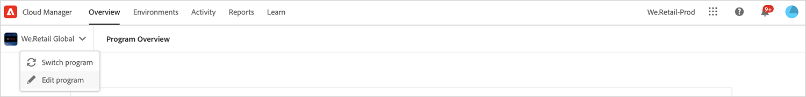
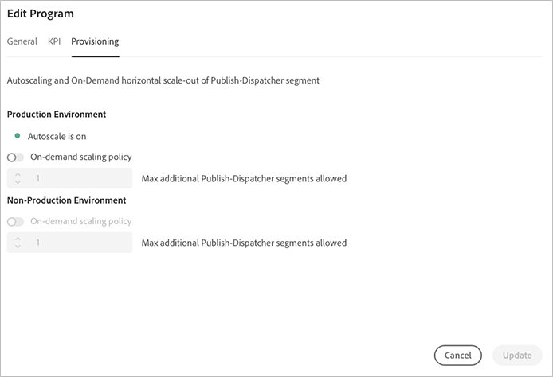

# Configurar o programa {#setup-your-program}

Após a integração, o proprietário da empresa precisará concluir uma configuração inicial do programa. Isso envolve definir a descrição do programa e os Indicadores-chave de desempenho (KPIs) que serão usados para testes de desempenho. Outra opção é fazer upload de uma miniatura. Além disso, o proprietário da empresa pode configurar o provisionamento de ambientes ao configurar o programa.

Os KPIs definidos servem como uma linha de base para o teste de desempenho, que é transmitido cada vez que o pipeline é executado.

>[!NOTE]
>Os KPIs definidos são medidos em testes executados no **estágio** ambiente. Normalmente, esses KPIs são reduzidos para se adequarem aos recursos do ambiente de preparo.
>Por exemplo, um usuário espera uma média de 1000 exibições de página por minuto em sua produção **Ambiente** e ter quatro servidores de dispatcher/publicação em produção deve dimensionar isso para 250 exibições de página por minuto (supondo que seu ambiente de preparo consista em apenas um único par de dispatcher/servidor de publicação).
>Além disso, muitos usuários terão uma Rede de entrega de conteúdo (CDN), como Akamai ou CloudFront em frente ao ambiente de produção. Since [!UICONTROL Cloud Manager] Testa diretamente o ambiente de preparo, o KPI deve refletir apenas o tráfego esperado para passar pelo CDN, ou seja, o cache não é utilizado. Normalmente, esse será um subconjunto relativamente pequeno do tráfego total de produção.

## Usando [!UICONTROL Cloud Manager] para configurar o programa {#using-cloud-manager-to-setup-your-program}

Siga as etapas abaixo para configurar o programa e definir KPIs:

1. Clique em **Programa de configuração** para iniciar o processo de configuração em [!UICONTROL Cloud Manager].

   

   >[!NOTE]
   > Você sempre pode alternar, editar ou adicionar um novo programa na barra de ações, como mostrado na figura abaixo.

   

1. O **Programa de configuração** exibe Editar informações do programa.

1. Você verá três opções como **Geral**, **KPI** e **Provisionamento** guia .

1. Em **Geral** carregue uma miniatura em seu programa. Você também pode adicionar uma descrição relevante ao seu programa.

   

1. Em **KPI**, você pode definir seus dois KPIs (expectativas para cada implantação). KPIs separados são definidos para **AEM Sites** e **AEM Assets**. Você poderá especificar os KPIs para os produtos que licenciou.

   **AEM Sites**

   1. Qual é o tempo de resposta do 95º percentil que é aceitável para você?

      * Valor recomendado - 3 segundos
   1. Quantas Exibições de página por minuto sob o pico de carga?

      * Valor recomendado - 200 visualizações de página por minuto

   **AEM Assets**

   Desde a versão inicial, o Cloud Manager tem sido capaz de executar testes de desempenho para programas AEM Sites. Com esta versão, o recurso foi adicionado para executar testes de desempenho para programas AEM Assets também. O teste de desempenho do ativo é feito fazendo o upload de ativos repetidamente durante um período de teste de 30 minutos e medindo o tempo de processamento de cada ativo, bem como de várias métricas no nível do sistema.
Durante a configuração do programa, os KPIs específicos dos ativos são especificados:

   * 95º tempo de processamento do percentual
   * Ativos carregados por minuto

   

1. Em **Provisionamento**, você pode exibir ou editar a configuração de provisionamento para ambientes de produção e não relacionados à produção em seu programa. Você verá **A Dimensionamento Automático está ativada**, se o dimensionamento automático tiver sido ativado para o programa.

   >[!NOTE]
   >O recurso de dimensionamento automático se aplica somente ao ambiente de produção e pode não estar disponível para todos os programas do cliente.

   

1. Clique em **Salvar** para concluir o assistente de configuração.

   >[!NOTE]
   >Você sempre poderá editar o programa depois que o programa inicial já tiver sido configurado. Siga as etapas abaixo para obter mais detalhes.

## Editar um programa {#editing-program}

1. Navegue até o programa a partir do **Cloud Manager** tela inicial.

1. Clique em **Editar programa** para atualizar ou modificar seu programa do **Visão geral** conforme mostrado na figura abaixo.

   

1. O **Editar programa** exibições de tela que permitem atualizar ou modificar o programa.

   Você pode atualizar a descrição do programa no **Geral** guia .

   

   Navegar para **KPI** para atualizar informações sobre AEM Sites e Assets.

   

   Além disso, você pode navegar para **Provisionamento** para editar a configuração de provisionamento para ambientes de produção e não-produção em seu programa.

   

1. Clique em **Atualizar** para salvar suas edições.

## Próximas etapas {#the-next-steps}

Se você já tiver configurado o pipeline, a próxima execução levará em conta as configurações atualizadas. Se ainda não tiver configurado o pipeline, siga as etapas para configurar seu pipeline primeiro.

Consulte os documentos [Configuração de pipeline de produção](configuring-production-pipelines.md) e [Configuração de pipeline de não produção](configuring-non-production-pipelines.md) para configurar o pipeline.
