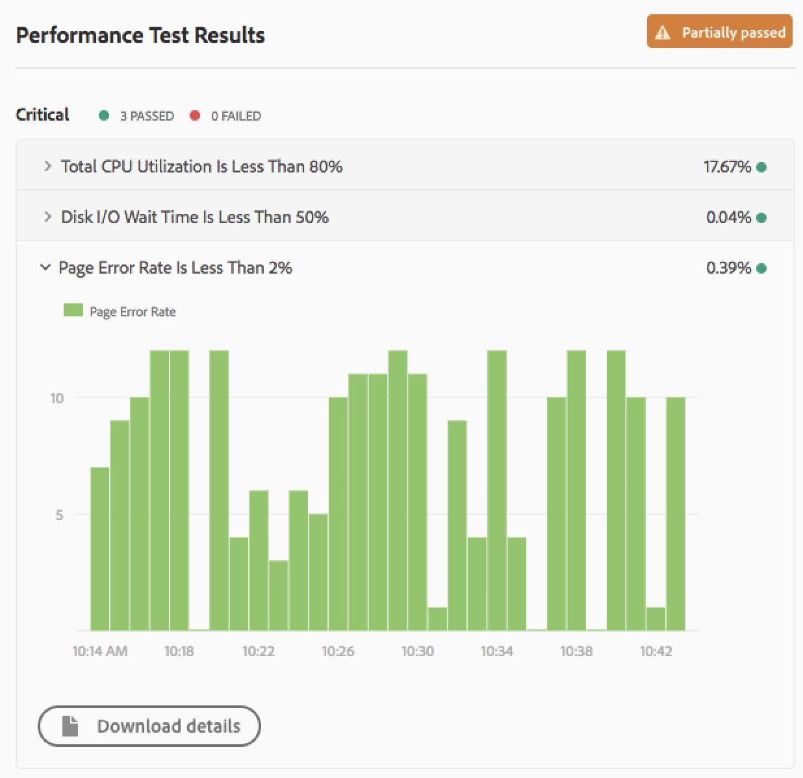

# Entender os resultados de teste {#understand-your-test-results}

Durante o processo de **Pipeline** , várias métricas são capturadas e comparadas aos Indicadores-chave de desempenho (KPIs) definidos pelo proprietário da empresa ou aos padrões definidos pelos Serviços gerenciados da Adobe.

Eles são reportados usando o sistema de portagem de três níveis, conforme definido nesta seção.

## Portas de três níveis ao executar um pipeline {#three-tier-gates-while-running-a-pipeline}

Há três portões no pipeline:

* Qualidade do código
* Teste de desempenho
* Teste de segurança

Para cada uma dessas portas, existe uma estrutura em três níveis para as questões identificadas pela porta.

* **Crítico** - São problemas identificados pela porta que causam uma falha imediata do pipeline.
* **Importante** - são problemas identificados pela porta que fazem com que o pipeline entre em um estado de pausa. Um gerente de implantação, gerente de projeto ou proprietário de negócios pode substituir os problemas, caso em que o pipeline continua, ou pode aceitar os problemas, caso em que o pipeline pára com uma falha.
* **Informações** - São questões identificadas pela porta, que são fornecidas apenas para fins informativos e não têm impacto na execução do pipeline.

>[!NOTE]
>
>Em um pipeline de qualidade de código somente, falhas importantes na porta de teste de qualidade de código não podem ser substituídas, pois a etapa de teste de qualidade de código é a etapa final no pipeline.

## Teste de qualidade de código {#code-quality-testing}

Como parte do pipeline, o código fonte é verificado para garantir que as implantações atendam a determinados critérios de qualidade. Atualmente, esta ação é implementada através de uma combinação de SonarQube e exame de nível de pacote de conteúdo utilizando OakPAL. Há mais de 100 regras que combinam regras genéricas do Java e regras específicas do AEM. A tabela a seguir resume a classificação dos critérios de teste:

| Nome | Definição | Categoria | Limite de falha |
|--- |--- |--- |--- |
| Classificação de segurança | A = 0 Vulnerabilidade <br/>B = pelo menos 1 Vulnerabilidade<br/> Menor C = pelo menos 1 Vulnerabilidade Principal <br/>D = pelo menos 1 Vulnerabilidade Crítica <br/>E = pelo menos 1 Vulnerabilidade Bloqueadora | Crítico | &lt; B |
| Classificação da confiabilidade | A = 0 Bug <br/>B = pelo menos 1 Bug Menor <br/>C = pelo menos 1 Bug Principal <br/>D = pelo menos 1 Bug Crítico E = pelo menos 1 Bug Bloqueador | Importante | &lt; C |
| Classificação da manutenção | O custo de correção excepcional para cheiros de código é: <br/><ul><li>&lt;=5% do tempo que já passou para o aplicativo, a classificação é A </li><li>entre 6 e 10%, a classificação é de </li><li>entre 11 e 20% a classificação é de C </li><li>entre 21 e 50% a classificação é um D</li><li>algo acima de 50% é um E</li></ul> | Importante | &lt; A |
| Cobertura | Uma combinação da cobertura da linha de teste da unidade e da cobertura da condição usando esta fórmula: <br/>`Coverage = (CT + CF + LC)/(2*B + EL)` <br/>onde: CT = condições que foram avaliadas como 'true' pelo menos uma vez durante a execução de testes de unidade <br/>CF = condições que foram avaliadas como 'false' pelo menos uma vez durante a execução de testes de unidade <br/>LC = linhas cobertas = lines_to_cover - uncovered_lines <br/><br/> B = número total de condições <br/>EL = número total de linhas executáveis (lines_to_cover) | Importante | &lt; 50% |
| Testes de unidade ignorados | Número de testes de unidade ignorados. | Informações | &gt; 1 |
| Problemas em aberto | Tipos de edição geral - Vulnerabilidades, Erros e Cheiros de código | Informações | &gt; 1 |
| Linhas Duplicadas | Número de linhas envolvidas em blocos duplicados. <br/>Para que um bloco de código seja considerado como duplicado: <br/><ul><li>**Projetos não Java:**</li><li>Deve haver pelo menos 100 tokens sucessivos e duplicados.</li><li>Esses tokens devem ser espalhados pelo menos em: </li><li>30 linhas de código para COBOL </li><li>20 linhas de código para ABAP </li><li>10 linhas de código para outras línguas</li><li>**Projetos Java:**</li><li> Deve haver pelo menos 10 declarações sucessivas e duplicadas, independentemente do número de tokens e linhas.</li></ul> <br/>As diferenças no recuo, bem como nos literais de string, são ignoradas ao detectar duplicações. | Informações | &gt; 1% |


>[!NOTE]
>
>Consulte Definições [de](https://docs.sonarqube.org/display/SONAR/Metric+Definitions) métricas para obter definições mais detalhadas.

Você pode fazer download da lista de regras aqui [code-quality-rules.xlsx](/help/using/assets/CodeQuality-Rules-new.xlsx)

>[!NOTE]
>
>Para saber mais sobre as regras de qualidade de código personalizadas executadas por [!UICONTROL Cloud Manager], consulte Regras [de qualidade de código](custom-code-quality-rules.md)personalizadas.

### Lidar com falsos positivos {#dealing-with-false-positives}

O processo de verificação da qualidade não é perfeito e, por vezes, identificará incorretamente questões que não são realmente problemáticas. Isso é conhecido como "falso positivo".

Nesses casos, o código fonte pode ser anotado com a `@SuppressWarnings` anotação padrão Java que especifica a ID da regra como o atributo de anotação. Por exemplo, um problema comum é que a regra SonarQube para detectar senhas codificadas pode ser agressiva sobre como uma senha codificada é identificada.

Para ver um exemplo específico, esse código seria bastante comum em um projeto do AEM que tem código para se conectar a algum serviço externo:

```java
@Property(label = "Service Password")
private static final String PROP_SERVICE_PASSWORD = "password";
```

A SonarQube criará uma Vulnerabilidade do Bloqueador. Depois de revisar o código, você identifica que isso não é uma vulnerabilidade e pode anotar isso com a ID de regra apropriada.

```java
@SuppressWarnings("squid:S2068")
@Property(label = "Service Password")
private static final String PROP_SERVICE_PASSWORD = "password";
```

No entanto, por outro lado, se o código era realmente este:

```java
@Property(label = "Service Password", value = "mysecretpassword")
private static final String PROP_SERVICE_PASSWORD = "password";
```

Em seguida, a solução correta é remover a senha codificada.

>[!NOTE]
>
>Embora seja uma prática recomendada tornar a `@SuppressWarnings` anotação o mais específica possível, ou seja, anotar somente a declaração específica ou o bloco que está causando o problema, é possível fazer anotações em nível de classe.

## Teste de segurança {#security-testing}

[!UICONTROL Cloud Manager] executa as verificações ***de integridade de segurança do*** AEM na etapa seguinte à implantação e relata o status pela interface do usuário. Os resultados são agregados de todas as instâncias do AEM no ambiente.

Se alguma das **Instâncias** reportar uma falha para uma determinada verificação de integridade, todo o **Ambiente** falhará nessa verificação de integridade. Como acontece com o teste de qualidade e desempenho de código, essas verificações de integridade são organizadas em categorias e relatadas usando o sistema de portagem de três níveis. A única distinção é que não existe um limiar no caso dos testes de segurança. Todos os exames de saúde são simplesmente aprovados ou reprovados.

A tabela a seguir lista as verificações atuais:

| **Nome** | **Implementação da verificação de integridade** | **Categoria** |
|---|---|---|
| A prontidão para anexar API do firewall de desserialização está em um estado aceitável | Disponibilidade da API de anexo do firewall de desserialização | Crítico |
| O firewall de desserialização está funcionando | Firewall de desserialização funcional | Crítico |
| O firewall de desserialização é carregado | Firewall de desserialização carregado | Crítico |
| A implementação AuthorizableNodeName não expõe a ID autorizada no nome/caminho do nó. | Geração do nome do nó autorizada | Crítico |
| As senhas padrão foram alteradas | Contas padrão de logon | Crítico |
| O servlet GET padrão Sling está protegido contra ataques DOS. | Sling Get Servlet | Crítico |
| O Manipulador de Sling Java Script está configurado adequadamente | Sling Java Script Handler | Crítico |
| O Sling JSP Script Handler está configurado adequadamente | Manipulador de script JSP Sling | Crítico |
| O SSL está configurado corretamente | Configuração do SSL | Crítico |
| Nenhuma política de perfil de usuário obviamente insegura encontrada | Acesso padrão ao perfil de usuário | Crítico |
| O Filtro do Sling Referrer está configurado para impedir ataques de CSRF | Sling Referrer Filter | Importante |
| O Adobe Granite HTML Library Manager está configurado adequadamente | Configuração do gerenciador de biblioteca HTML CQ | Importante |
| O pacote de suporte CRXDE está desativado | Suporte do CRXDE | Importante |
| O conjunto e o servlet Sling DavEx estão desativados | Verificação de integridade do DavEx | Importante |
| O conteúdo de amostra não está instalado | Pacotes de conteúdo de exemplo | Importante |
| O Filtro de Solicitação WCM e o Filtro de Depuração WCM estão desativados | Configuração de filtros WCM | Importante |
| O pacote e o servlet WebDAV Sling estão configurados adequadamente | Verificação de integridade do WebDAV | Importante |
| O servidor da Web está configurado para impedir o recurso de clickjacking | Configuração de servidor da Web | Importante |
| A replicação não está usando o usuário 'admin' | Reprodução e usuários de transporte | Informações |

## Teste de desempenho {#performance-testing}

*O teste* de desempenho em [!UICONTROL Cloud Manager] é implementado usando um teste de 30 minutos.

Durante a configuração do pipeline, o gerente de implantação pode decidir quanto tráfego direcionar para cada bucket.

Você pode saber mais sobre controles de bucket, em [Configure seu Pipeline](configuring-pipeline.md)CI/CD.

>[!NOTE]
>
>Para configurar seu programa e definir seus KPIs, consulte [Configurar seu programa](setting-up-program.md).

A tabela a seguir resume a matriz de teste de desempenho usando o sistema portátil de três níveis:

| **Métrica** | **Categoria** | **Limite de falha** |
|---|---|---|
| Taxa de erro de solicitação de página % | Crítico | &gt;= 2% |
| Taxa de utilização da CPU | Crítico | &gt;= 80% |
| Tempo de espera de E/S de disco | Crítico | &gt;= 50% |
| Tempo de Resposta de 95% | Importante | &gt;= KPI de nível de programa |
| Tempo de resposta máximo | Importante | &gt;= 18 segundos |
| Exibições de página por minuto | Importante | &lt; KPI de nível de programa |
| Utilização da largura de banda do disco | Importante | &gt;= 90% |
| Utilização da largura de banda da rede | Importante | &gt;= 90% |
| Solicitações por minuto | Informações | &lt; 6000 |

### Gráficos de resultados de teste de desempenho {#performance-testing-results-graphs}

Novos gráficos e opções de download foram adicionados à caixa de diálogo Resultados do teste de desempenho.

Ao abrir a caixa de diálogo Teste de desempenho, os painéis de métricas podem ser expandidos para exibir um gráfico, fornecer um link para um download ou ambos.

Para a [!UICONTROL Cloud Manager] versão 2018.7.0, essa funcionalidade está disponível para as seguintes métricas:

* **Utilização da CPU**
   * Um gráfico de Utilização da CPU durante o período de teste.

* **Tempo de espera de E/S do disco**
   * Um gráfico de Tempo de espera de E/S do disco durante o período de teste.

* **Taxa de erro de página**
   * Um gráfico de erros de página por minuto durante o período de teste.
   * Um arquivo CSV que lista as páginas que apresentaram um erro durante o teste.

* **Utilização da largura de banda do disco**
   * Um gráfico de Utilização da Largura de Banda do Disco durante o período de teste.

* **Utilização da largura de banda da rede**
   * Um gráfico de Utilização da Largura de Banda da Rede durante o período de teste.

* **Tempo de resposta máximo**
   * Um gráfico do tempo de resposta de pico por minuto durante o período de teste.

* **95.º Percentual de Tempo de Resposta**
   * Gráfico de 95% de tempo de resposta por minuto durante o período de teste.
   * Um arquivo CSV que lista as páginas cujo tempo de resposta de 95% excedeu o KPI definido.

As seguintes imagens exibem os gráficos de teste de desempenho:




