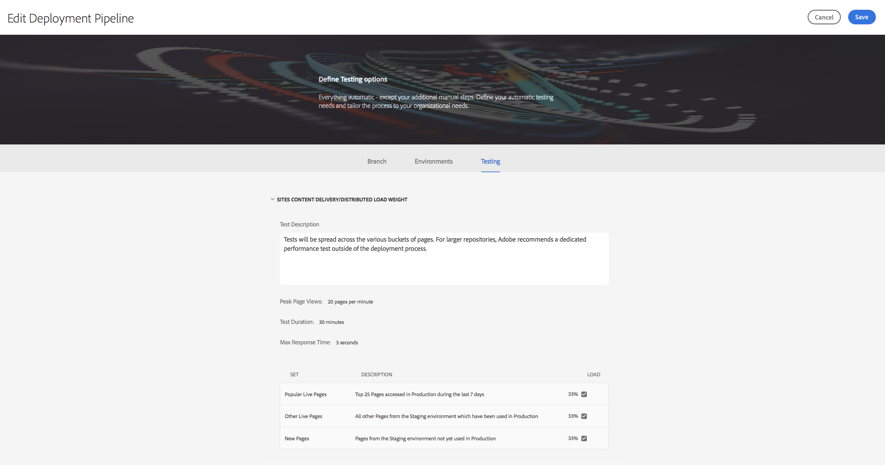
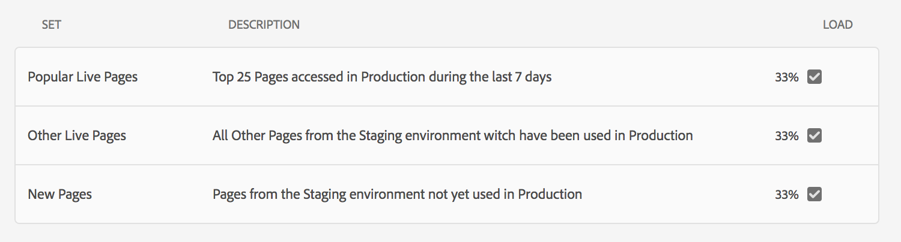

# Uso do Cloud Manager{#using-cloud-manager}

Esta seção explica a interface do usuário (UI) para [!UICONTROL Cloud Manager] e explica o fluxo de trabalho da configuração do programa para a implantação do código, seguido de verificações de qualidade.

## Pré-requisitos {#prerequisites}

Antes de entrar nos detalhes de uso do [!UICONTROL Cloud Manager], é recomendável passar pelas seguintes seções:

* [Compreensão dos conceitos antes de usar o [!UICONTROL Cloud Manager]](understanding-concepts.md)
* [Configuração de Configurações Gerais para [!UICONTROL Cloud Manager]](setting-configurations-for-cloud-manager.md)

## Getting Started with [!UICONTROL Cloud Manager] {#getting-started-with-cloud-manager}

Depois de configurar as configurações gerais para [!UICONTROL Cloud Manager], você estará pronto para usar o [!UICONTROL Cloud Manager].

1. Faça logon na Adobe [!UICONTROL Experience Cloud] e você verá a lista de soluções.

   

1. Selecione o programa e clique no ícone superior esquerdo para abrir [!UICONTROL Cloud Manager].

   

## Configuração do programa {#setting-up-program}

Após a integração, o proprietário da empresa precisará fazer uma configuração inicial do programa. Isso envolve definir a descrição do programa e definir os KPIs que serão usados para testes de desempenho. Como opção, uma miniatura pode ser carregada.

Os KPIs definidos servem como uma linha de base para testes de desempenho que são passados cada vez que o pipeline é executado.

>[!NOTE]
>
>Os KPIs definidos são medidos em testes executados no ambiente do **palco** . Normalmente, esses KPIs são reduzidos para se ajustarem aos recursos do ambiente do palco.
>
>Por exemplo, um usuário que espera uma média de 1.000 exibições de página por minuto em seu ambiente de produção e que tenha quatro `dispatcher/publish` servidores em produção deve dimensionar isso para 250 exibições de página por minuto (considerando que seu ambiente de estágio consista em apenas um par de `dispatcher/publish` servidores).
>
>Além disso, muitos usuários terão um CDN (Akamai, CloudFront) em frente ao ambiente de produção. Como [!UICONTROL Cloud Manager] os testes contra o ambiente do palco são feitos diretamente, o KPI deve refletir apenas o tráfego que se espera que passe pelo CDN, ou seja, o cache não tem acesso. Normalmente, esse será um subconjunto relativamente pequeno do tráfego total de produção.

### Usar [!UICONTROL Cloud Manager] para definir KPIs {#using-cloud-manager-to-define-kpis}

Siga as etapas abaixo para configurar o programa e definir KPIs:

1. Clique em **Programa** de instalação para iniciar o processo de configuração em [!UICONTROL Cloud Manager].
1. A tela **Editar informações** do programa é exibida.

   Carregue uma miniatura em seu programa. Você também pode adicionar uma descrição relevante ao seu programa e clicar em **Avançar**.

1. A tela **Configurar usuários** é exibida.

   Você pode configurar as funções e os usuários de sua equipe. Clique em **Avançar**.

1. A tela **Configure General Business KPIs (Configurar KPIs** Gerais de Negócios) é exibida.

   Você pode definir seus dois KPIs (expectativas para cada implantação):

   1. Qual é o tempo de resposta do 95º percentil que é aceitável para você?

      1. Valor recomendado - 3 segundos
   1. Quantas Exibições de página por minuto sob o pico de carga?

      1. Valor recomendado - 200 pv/m


1. Clique em **Enviar** para concluir o assistente de configuração.

   Você verá a tela inicial para [!UICONTROL Cloud Manager] alterar para **Implantar**.

## Ambientes disponíveis {#available-environments}

Os Ambientes **** disponíveis na lista [!UICONTROL Cloud Manager] todos os ambientes AEM gerenciados.

Cada um dos ambientes listados terá um status associado a ele.

## Configurando o Pipeline {#configuring-pipeline}

### Configuração do Pipeline {#setting-up-pipeline}

>[!CAUTION]
>
>O pipeline não pode ser configurado até que o repositório git tenha pelo menos uma ramificação.

Antes de começar a implantar seu código, você deve definir as configurações de pipeline do [!UICONTROL Cloud Manager].

Para saber mais sobre a configuração de pipeline, consulte a seção Visão geral **de** pipeline em ** [Compreensão de conceitos antes de Usar o [!UICONTROL Cloud Manager]](understanding-concepts.md)**.

>[!NOTE]
>
>É possível alterar as configurações do pipeline após a configuração inicial.

### Configuração das configurações de pipeline a partir do [!UICONTROL Cloud Manager]{#configuring-pipeline-settings-from-the-cloud-manager}

Siga as etapas abaixo de [!UICONTROL Cloud Manager] para configurar o comportamento e as preferências do pipeline:

1. Acesse a guia **Ramificação** para configurar a ramificação do aplicativo.

   Selecione a ramificação git que deseja configurar.

   >[!NOTE]
   >
   >As ramificações encontradas no repositório Git estão vinculadas ao seu programa.

   

1. Acesse a guia **Ambientes** para selecionar as opções **Estágio** e **Produção** .

   Você pode definir o acionador que iniciará o pipeline:

   * **Manual** - alguém precisa clicar manualmente na interface do usuário para iniciar o pipeline.
   Agora você define os parâmetros que controlam a implantação de produção. As três opções disponíveis são as seguintes:

   * **Usar aprovação** em tempo real - uma implantação deve ser aprovada manualmente por um proprietário comercial, gerente de projeto ou gerente de implantação por meio da [!UICONTROL Cloud Manager] interface do usuário.
   * **Usar a Supervisão** de CSE - Um CSE está envolvido para realmente iniciar a implantação.
   

1. Acesse a guia **Teste** para definir seus critérios de teste para o programa.

   Agora, você pode configurar os parâmetros de teste de desempenho.

   

## Implantação de código {#deploying-code}

Depois de configurar seu pipeline (repositório, ambiente e ambiente de teste), você estará pronto para implantar seu código.

### Implantação de código de [!UICONTROL Cloud Manager]{#deploying-code-from-cloud-manager}

Siga as etapas abaixo para implantar seu código no ambiente de produção:

1. Clique em **Implantar** do [!UICONTROL Cloud Manager] para iniciar o processo de implantação.
1. A tela Implantação **do** estágio é exibida.

   Clique em **Criar** para iniciar o processo.

1. O processo de compilação completo leva em conta vários parâmetros para verificar e implantar seu código.

   Os seguintes parâmetros que são marcados são os seguintes:

   **Implantação do estágio**

   * Repositório
   * Teste de unidade
   * Digitalização de código
   * Implantado no ambiente de estágio
   **Teste de pré-produção**

   * Teste de segurança
   * Teste de desempenho
   >[!NOTE]
   >
   >Além disso, você pode visualizar registros ou revisar resultados para os critérios de teste mencionados acima.

## Resultados das verificações de qualidade {#results-from-quality-checks}

Há três portões no pipeline: Qualidade de código, teste de desempenho e teste de segurança.

Para cada uma dessas portas, existe uma estrutura em três níveis para as questões identificadas pela porta.

* **Crítico** - São problemas identificados pela porta que causam uma falha imediata do pipeline.
* **Importante** - são problemas identificados pela porta que fazem com que o pipeline entre em um estado de pausa. Um gerente de implantação, gerente de projeto ou proprietário de negócios pode substituir os problemas, caso em que o pipeline continua, ou pode aceitar os problemas, caso em que o pipeline pára com uma falha.
* **Informações** - São questões identificadas pela porta, que são fornecidas apenas para fins informativos e não têm impacto na execução do pipeline.

### Digitalização de código {#code-scanning}


### Teste de desempenho {#performance-testing}

*O teste* de desempenho em [!UICONTROL Cloud Manager] é implementado usando um teste de 30 minutos.

Durante a configuração do pipeline, o gerente de implantação pode decidir quanto tráfego direcionar para cada bucket. Eles podem escolher em qualquer lugar de um a todos os três baldes. A distribuição do tráfego se baseia no número de compartimentos selecionados, ou seja, se todos os três forem selecionados, 33% do total de exibições de página serão colocadas em cada grupo; se dois forem selecionados, 50% serão atribuídos a cada conjunto; se um estiver selecionado, 100% do tráfego vai para esse conjunto.

Por exemplo, digamos que haja uma divisão de 50%/50% entre as Páginas ativas populares e as Novas páginas definidas (neste exemplo, Outras páginas ao vivo não são usadas) e o conjunto Novas páginas contém 3000 páginas. O KPI de exibições de página por minuto está definido como 200. Durante o período de teste de 30 minutos:

* Cada uma das 25 páginas no conjunto de páginas ativas populares será acessada 240 vezes - `((200 &#42; 0.5) / 25) &#42; 30 = 120`
* Cada uma das 3000 páginas no conjunto Novas páginas será acessada uma vez - `((200 &#42; 0.5) / 3000) &#42; 30 = 1`



### Métricas de teste de desempenho {#performance-test-metrics}

Durante o período de teste, várias métricas são capturadas e comparadas com os KPIs definidos pelo proprietário da empresa ou com os padrões definidos pelo AMS.

Estes são reportados utilizando o sistema de portagem de três níveis da seguinte forma:

### Portas de três níveis ao executar um pipeline {#three-tier-gates-while-running-a-pipeline}

Há três portas no pipeline como Qualidade de código, Teste de desempenho e Teste de segurança.

Para cada uma dessas portas, existe uma estrutura em três níveis para as questões identificadas pela porta:

* **Crítico**: Estes são problemas identificados pela porta que causam uma falha imediata do pipeline.
* **Importante**: Esses são problemas identificados pela porta que fazem com que o pipeline entre em um estado de pausa. Um gerente de implantação, gerente de projeto ou proprietário de negócios pode substituir os problemas, caso em que o pipeline continua, ou pode aceitar os problemas, caso em que o pipeline pára com uma falha.
* **Informações**: Trata-se de questões identificadas pela porta, que são fornecidas apenas para fins informativos e não têm impacto na execução do gasoduto.

A tabela a seguir resume a matriz de teste de desempenho usando o sistema portátil de três níveis:

| **Métrica** | **Categoria** | **Limite de falha** |
|---|---|---|
| Taxa de erro de solicitação de página % |  Crítico | &gt;= 2% |
| Taxa de utilização da CPU |  Crítico | &gt;= 80% |
| Tempo de espera de E/S de disco |  Crítico | &gt;= 50% |
| Tempo de Resposta de 95% | Importante | &gt;= KPI de nível de programa |
| Tempo de resposta máximo | Importante | &gt;= 18 segundos |
| Exibições de página por minuto | Importante | &lt; KPI de nível de programa |
| Utilização da largura de banda do disco | Importante | &gt;= 90% |
| Utilização da largura de banda da rede | Importante | &gt;= 90% |
| Solicitações por minuto | Informações | &lt; 6000 |

### Teste de segurança {#security-testing}

[!UICONTROL Cloud Manager] executa as verificações *de integridade de segurança do* AEM na etapa seguinte à implantação e relata seu status pela interface do usuário. Os resultados são agregados de todas as instâncias do AEM no ambiente.

Se alguma das instâncias reportar uma falha para uma determinada verificação de integridade, todo o ambiente falhará nessa verificação de integridade. Como acontece com o teste de qualidade e desempenho de código, essas verificações de integridade são organizadas em categorias e relatadas usando o sistema de portagem de três níveis. A única distinção é que não existe um limiar no caso dos testes de segurança. Todos os exames de saúde são simplesmente aprovados ou reprovados.

As verificações atuais são:

| **Verificação de integridade** | **Categoria** |
|---|---|
| Disponibilidade da API de anexo do firewall de desserialização |  Crítico |
| Firewall de desserialização funcional |  Crítico |
| Firewall de desserialização carregado |  Crítico |
| Geração do nome do nó autorizada |  Crítico |
| Contas padrão de logon |  Crítico |
| Sling Get Servlet |  Crítico |
| Configuração do Dispatcher do controle de qualidade |  Crítico |
| Configuração do gerenciador de biblioteca HTML CQ |  Crítico |
| Sling Java Script Handler |  Crítico |
| Sling Jsp Script Handler |  Crítico |
| Sling Referrer Filter |  Crítico |
| Configuração do SSL |  Crítico |
| Acesso padrão ao perfil de usuário |  Crítico |
| Suporte do CRXDE | Importante |
| Verificação de integridade do DavEx | Importante |
| Pacotes de conteúdo de exemplo | Importante |
| Configuração de filtros WCM | Importante |
| Verificação de integridade do WebDAV | Importante |
| Configuração de servidor da Web | Importante |
| Reprodução e usuários de transporte | Informações |

### Implementação da verificação de qualidade por SonarQube {#quality-check-implementation-by-sonarqube}

Como parte do pipeline, conforme descrito acima, o código é verificado. Atualmente, isso é implementado pela SonarQube. Temos 93 regras que são uma combinação de regras genéricas do Java e regras específicas do AEM (incluindo algumas do conjunto de regras existente do Cognifide). Uma lista dessas regras pode ser encontrada aqui: [code-quality-rules.xlsx](/help/using/assets/code-quality-rules.xlsx)

Dessas regras, é calculada uma variedade de métricas, algumas das quais são usadas como uma porta de qualidade antes de permitir uma implantação no ambiente de estágio.

Estes são os limiares atuais:

| Nome | Definição | Categoria | Limite de falha |
|--- |--- |--- |--- |
| Classificação de segurança | A = 0 Vulnerabilidade <br/>B = pelo menos 1 Vulnerabilidade<br/> Menor C = pelo menos 1 Vulnerabilidade Principal <br/>D = pelo menos 1 Vulnerabilidade Crítica <br/>E = pelo menos 1 Vulnerabilidade Bloqueadora |  Crítico | &lt; B |
| Classificação da confiabilidade | A = 0 Bug <br/>B = pelo menos 1 Bug Menor <br/>C = pelo menos 1 Bug Principal <br/>D = pelo menos 1 Bug Crítico E = pelo menos 1 Bug Bloqueador | Importante | &lt; C |
| Classificação da manutenção | O custo de correção excepcional para cheiros de código é: <br/><ul><li>&lt;=5% do tempo que já passou para o aplicativo, a classificação é A </li><li>entre 6 e 10%, a classificação é de </li><li>entre 11 e 20% a classificação é de C </li><li>entre 21 e 50% a classificação é um D</li><li>algo acima de 50% é um E</li></ul> | Importante | &lt; A |
| Cobertura | Uma combinação de cobertura de linha e cobertura de condição usando esta fórmula: <br/>`Coverage = (CT + CF + LC)/(2*B + EL)` <br/>onde: CT = condições que foram avaliadas como 'true' pelo menos uma vez <br/>CF = condições que foram avaliadas como 'false' pelo menos uma vez <br/>LC = linhas cobertas = lines_to_cover - uncovered_lines <br/><br/> B = número total de condições <br/>EL = número total de linhas executáveis (lines_to_cover) | Importante | &lt; 50% |
| Testes de unidade ignorados | Número de testes de unidade ignorados. | Informações | &gt; 1 |
| Problemas em aberto | Tipos de edição geral - Vulnerabilidades, Erros e Cheiros de código | Informações | &gt; 1 |
| Linhas Duplicadas | Número de linhas envolvidas em blocos duplicados. <br/>Para que um bloco de código seja considerado como duplicado: <ul><li> **Projetos não Java:**</li><li>Deve haver pelo menos 100 tokens sucessivos e duplicados.</li><li>Esses tokens devem ser espalhados pelo menos em: </li><li>30 linhas de código para COBOL </li><li>20 linhas de código para ABAP </li><li>10 linhas de código para outras línguas</li></ul><ul><li>**Projetos Java:**</li><li> Deve haver pelo menos 10 declarações sucessivas e duplicadas, independentemente do número de tokens e linhas.</li></ul>As diferenças no recuo, bem como nos literais de string, são ignoradas ao detectar duplicações. | Informações | &gt; 1% |

### Falsos Positivos {#false-positives}

O processo de verificação da qualidade não é perfeito e, por vezes, identificará incorretamente questões que não são realmente problemáticas. Isso é chamado de *falso positivo* (embora *falso negativo* provavelmente seja mais semanticamente correto). Nesses casos, o código fonte pode ser anotado com a `@SuppressWarnings` anotação padrão Java que especifica a ID da regra como o atributo de anotação. Por exemplo, um problema comum é que a regra SonarQube para detectar senhas codificadas é muito liberal sobre o que considera uma senha codificada.

Para ver um exemplo específico, esse código seria bastante comum em um projeto do AEM que tem código para se conectar a algum serviço externo:

```java
@Property(label = "Service Password")
private static final String SERVICE_PASSWORD = "password";
```

A SonarQube vai aumentar isto como uma Vulnerabilidade do Bloqueador. Nesse caso, o cliente pode identificar que isso não é uma vulnerabilidade e anotar isso com a ID de regra apropriada:

```java
@SuppressWarnings("squid:S2068")
@Property(label = "Service Password")
private static final String SERVICE_PASSWORD = "password";
```

No entanto, por outro lado, se o código era realmente este:

```java
@Property(label = "Service Password", value = "mysecretpassword")
private static final String SERVICE_PASSWORD = "password";
```

Em seguida, o cliente deve levar a sério o aviso da SonarQube e remover a senha codificada. No entanto, eles ainda precisarão adicionar a `@SuppressWarnings` anotação, pois a regra SonarQube está sendo acionada pelo termo `password`.

>[!NOTE]
>
>É uma prática recomendada tornar a `@SuppressWarnings` anotação o mais específica possível, ou seja, anotar somente a declaração específica ou o bloco que está causando o problema, é possível fazer anotações em nível de classe.

